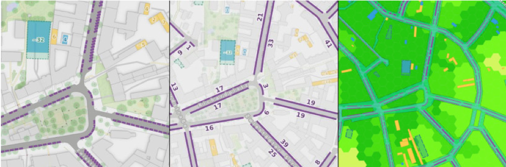
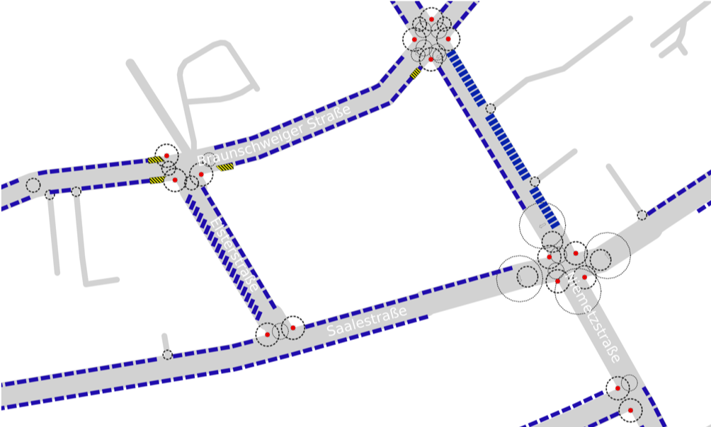

**There is [an English version of this post in @Supaplex030's OSM Blog](https://www.openstreetmap.org/user/Supaplex030/diary/396104).**

Dieser Blogpost ist zuerst [in @Supaplex030s OpenStreetMap Blog veröffentlicht worden](https://www.openstreetmap.org/user/Supaplex030/diary/396105). Dort kann man ihn auch [mit OSM-Account kommentieren](https://www.openstreetmap.org/user/Supaplex030/diary/396105#newcomment).

OSM-Daten bieten das Potential, präzise Parkplatzzählungen und Parkraumanalysen durchzuführen und damit wertvolles Wissen für Diskussionen rund um die Verkehrswende, Stadtentwicklung und Mobilität bereitzustellen. Vielerorts gibt es nämlich noch gar kein systematisches Wissen, wo es wie viele Parkplätze am Straßenrand (oder auch darüber hinaus) gibt. In aufwendigen Studien müssen diese Daten bei Bedarf erfasst werden -- und meist sind diese Daten anschließend nicht für die Öffentlichkeit zugänglich. Im Gegensatz dazu stellt OSM eine optimale Umgebung dar, in der solche Daten frei zugänglich erfasst und analysierbar gemacht werden können.

Am Beispiel des Berliner Stadtteils Neukölln haben wir demonstriert, wie urbane Parkplätze systematisch auf OSM-Basis kartiert und mit Geoinformationssystemen (hier: QGIS) und unter Einbezug weiterer offener Daten hochaufgelöst ausgewertet werden können. Dieser Blogpost soll euch einen Überblick über die Methodik geben und ein paar wichtige Ergebnisse und Erfahrungen für die OSM-Praxis mit euch teilen.

Einen ausführlichen Blick auf die Ergebnisse und Daten könnt ihr in der [Neuköllner Parkraumkarte](https://supaplexosm.github.io/strassenraumkarte-neukoelln/?map=parkingmap) werfen, in der die Parkplatzinformationen visualisiert werden, die zugrunde liegenden Daten zum Download bereit stehen und bei Bedarf ausführlichere Infos zur Herangehensweise und Methodik zu finden sind.

{: class='img-thumbnail' }

_Abbildung 1: Ausschnitt der Parkraumkarte, die auf verschiedenen Zoomstufen verschiedene Ergebnisse visualisiert: Von einzelnen Stellplätzen über straßenzugsweise Stellplatzzahlen bis hin zur Stellplatzdichte und dem Flächenverbrauch durch geparkte Fahrzeuge._

Hinweis: Die hier vorgestellte Parkraumanalyse geht auf erste Experimente im vergangenen Jahr zurück, [über die hier damals bereits berichtet wurde](https://www.openstreetmap.org/user/Supaplex030/diary/393423). Das Verfahren ist inzwischen weiter automatisiert worden, sodass es leichter auf andere Orte übertragen werden kann. Da OSM-Daten zum Parken am Fahrbahnrand aber bisher an vielen Orten noch nicht zu den „Standardinformationen" gehören und oft nur rudimentär oder gar nicht erfasst sind, ist es dafür wohl meistens notwendig, diese Daten selbst zu kartieren bzw. zu vervollständigen.

## Methodik
{: class='mt-5 mb-3' }

Für die hier vorgestellte Parkraumanalyse sind im letzten Jahr zunächst systematisch alle **straßenbegleitenden Parkplätze** (Parkstreifen am Straßenrand) im Untersuchungsgebiet in OSM kartiert worden -- ebenso wie andere relevante Objekte wie Grundstückseinfahrten und Informationen zu Gehwegübergängen (da dort nicht geparkt werden darf). Das zur Erfassung straßenbegleitenden Parkens etablierte OSM-Schema ist das [parking:lane-Schema](https://wiki.openstreetmap.org/wiki/Key:parking:lane): Auch wenn dieses Schema seine Macken hat, ihm eine Weiterentwicklung an manchen Stellen gut tun würde und es nicht alternativlos ist (siehe letzter Abschnitt), eignet es sich grundsätzlich dennoch sehr gut für Auswertungen wie diese und liefert relativ präzise Ergebnisse. Der Ansatz dieses Schemas ist es, einem Straßensegment jeweils Informationen zum Parken am linken und rechten Fahrbahnrand zuzuordnen. Dazu gehören vor allem die *Art des Parkens* (entweder Park- oder Halteverbote oder die Anordnung/Ausrichtung der geparkten Fahrzeuge, insbesondere Längs-, Schräg- und Querparken), die *Position des Parkens* (die Fahrzeuge können auf der Fahrbahn, in einer Parkbucht, auf dem Gehweg, halb auf dem Gehweg oder auf dem Seitenstreifen stehen) sowie *Bedingungen und Einschränkungen* (Stellplätze können insbesondere für bestimmte Nutzergruppen reserviert, zeitlich begrenzt nutzbar oder gebührenpflichtig sein).

Die Straßensegmente liegen geometrisch als Linienobjekte vor, die geteilt werden können, wenn sich Attribute im Straßenverlauf ändern. Besteht entlang eines Teilabschnitts einer Straße beispielsweise ein Parkverbot, kann dieses direkt über ein eigenes Straßensegment differenziert werden. Kurze und kleinteilige Änderungen (wie Halteverbote vor Einfahrten oder an Gehwegübergängen) müssen -- und sollen -- nicht gesondert segmentiert werden, da ansonsten eine unübersichtliche Anzahl von Linienstücken entstehen würde und diese Informationen im späteren Verlauf der Auswertung ohnehin aus den entsprechenden OSM-Datenobjekten abgeleitet werden können.

Die Verarbeitung der OSM-Daten erfolgte unterstützt durch Python-Skripte in QGIS ([ein Skript zur Erzeugung von Parkstreifen aus OSM-Daten ist hier zu finden](https://github.com/SupaplexOSM/strassenraumkarte-neukoelln/tree/main/scripts)) und orientierte sich etwa an dieser Abfolge:

- Entsprechend der Fahrbahnbreite, die entweder direkt am Straßenobjekt hinterlegt ist oder aus seinen Attributen abgeschätzt werden kann, können die räumlichen Verläufe der jeweils linken und rechten Parkstreifen (durch versetzen) mit ihren jeweils spezifischen Eigenschaften abgeleitet werden.

- Bereiche, an denen laut Straßenverkehrsordnung ein Park- bzw. Halteverbot besteht oder die sich entsprechend ihrer baulichen Anlage nicht zum Parken eignen, und die nicht bereits durch beschilderte Park- und Halteverbote mit dem parking:lane-Schema abgebildet sind, können anschließend aus den Daten ausgeschlossen werden, in dem dort Abschnitte mit einer vorbestimmten Länge abgetrennt werden. Die Ausdehnung dieser Bereiche ergibt sich aus juristischen Richtwerten oder ihrer typischen baulichen Anlage (z.B. kein Parken 5 Meter vor Kreuzungen oder 15 Meter vor oder hinter einer Bushaltestelle, kein Parken vor Einfahrten, an Fußgängerüberwegen oder im Bereich von Gehwegvorstreckungen etc.).

- Objekte, die das Parken im Parkstreifenbereich verhindern, wurden vor der Auswertung systematisch kartiert und in einem separaten Arbeitsschritt mit Sicherheitsabständen von den Parkbereichen abgezogen (z.B. Straßenbäume, Laternen, Poller, Bordsteinstrukturen, Fahrradständer und insbesondere beim Parken auf Gehwegen auch Straßenschilder, Straßenmöbel und Gehweg-Einbauten wie Verteilerkästen).

- Das Ergebnis wurde anschließend für die vorliegende Auswertung auf Fehler überprüft und teils aufwendig manuell nachbearbeitet, um die Präzision der Ergebnisse zu erhöhen ([siehe Parkraumkarte](https://supaplexosm.github.io/strassenraumkarte-neukoelln/?map=parkingmap)). Die allgemeine Aussagekraft der Ergebnisse wäre (bei ausreichend guter Kartierung der wesentlichen Objekte) aber auch ohne eine solche Nachbearbeitung gegeben und ist bei Übertragung auf andere Orte daher eher verzichtbar.

- Abschließend wurden Stellplatzkapazitäten für zusammenhängende Parkstreifensegmente berechnet (Quotient aus der Länge eines Segments und dem Abstand der dort geparkten Fahrzeuge, je nach Ausrichtung des Parkens).

{: class='img-thumbnail' }

_Abbildung 2: Generierung von Parkstreifensegmenten (blau) und baulichen Park-/Halteverbotszonen (Kreise). Weitere Objektgeometrien, die das Parken verhindern, können an die Parkstreifen gesnappt und von diesen abgezogen werden (hier Fahrradständer im Fahrbahnbereich, gestreifte Flächen). Kleiner Ausschnitt des Untersuchungsgebiets und provisorische Visualisierung während des Berechnungsprozesses._

Die hier vorgestellte Parkraumanalyse berücksichtigt darüber hinaus auch Informationen zu (meist privaten) **Stellplätzen abseits des Straßenraums**, die ebenso systematisch erhoben wurden. Dazu zählen allgemeine, meist ebenerdige Park- und Stellplätze, Tiefgaragen, Garagen und Carports sowie Parkhäuser. Für diese Objekte kann häufiger eine genaue Stellplatzzahl angegeben werden, da diese oft markiert und abzählbar sind. Aus ihrer Grundfläche (und, bei mehrstöckigen Objekten, ggf. unter Berücksichtigung ihrer horizontalen Ausdehnung) kann die Stellplatzkapazität aber auch hier geometrisch abgeschätzt werden.

Da viele dieser Stellplätze nicht oder nur schwer aus dem öffentlichen Raum zugänglich oder erkennbar sind, wurden für die Erhebung und Vervollständigung dieser Flächen einige externe Geodatensätze einbezogen, die hier in Berlin zum Glück zahlreich in guter Qualität und frei verwendbar vorhanden sind: So wurden Luftbilder systematisch auf Stellplätze in Hinterhöfen etc. geprüft und Tiefgaragenflächen oder Infos zu Garagengebäuden konnten aus dem Amtlichen Liegenschaftskatasterinformationssystem (ALKIS) abgeleitet werden. Nach Plausibilitätsprüfung fanden diese Daten Eingang in die verwendeten Rohdatensätze -- insbesondere bei den Tiefgaragen wurden in OSM aber nur die vor Ort überprüfbaren Merkmale hinterlegt, also die Ein- und Ausfahrten, aber nicht die Grundflächen.

Die Stellplatzdaten sind damit nicht nur geometrisch erfasst, sondern können auch zusätzliche Attribute enthalten wie zu Beschränkungen der Nutzung oder Zugänglichkeit (öffentlich/privat/Kunden etc., Gebühren, zeitliche Beschränkungen) und können auf dieser Grundlage gezielt ausgewertet werden.

Bei einer Größe des Untersuchungsgebiets von über 20 km², einer Länge des dortigen Straßennetzes von etwa 170 km, insgesamt 2.200 in OSM gemappten Grundstückseinfahrten und über 2.000 Parkplatzflächen klingt dies zunächst nach erheblichem Arbeitsaufwand. Tatsächlich war es aber innerhalb weniger Monate ohne weiteres möglich, diese Informationen auch als Einzelperson zu erfassen bzw. zu prüfen und zu vervollständigen -- umso schneller geht es natürlich, wenn mehrere Mapper arbeitsteilig vorgehen.

## Zentrale Zahlen und Ergebnisse
{: class='mt-5 mb-3' }

Viele Ergebnisse und Zahlen des Projekts sind in der [Neuköllner Parkraumkarte](https://supaplexosm.github.io/strassenraumkarte-neukoelln/?map=parkingmap) dargestellt und können kaum übersichtlich in Worte gefasst werden. Der Fokus dieses Projekts lag auch eher in der Entwicklung einer Methode und der Bereitstellung der Daten als in der Interpretation von Ergebnissen, daher soll hier nur kurz darauf eingegangen werden. Mehr Daten und Zahlen sind außerdem [im Methodenbericht](https://supaplexosm.github.io/strassenraumkarte-neukoelln/parkraumkarte/report) und [auf der Datenseite zum Projekt](https://supaplexosm.github.io/strassenraumkarte-neukoelln/data) zu finden.

Für den Ortsteil Neukölln, einem großstädtischen Wohnquartier mit etwa 165.000 Einwohnenden, ergaben sich insgesamt über 27.300 Kfz-Stellplätze im öffentlichen Straßenraum. Dazu kommen noch einmal etwa 12.200 Stellplätze abseits des Straßenraums, die sich dauerhaft bzw. über Nacht zum Parken für Anwohnende eignen (sowie 8.100 nicht zum dauerhaften Parken geeignete Stellplätze wie Mitarbeiter- und Kundenparkplätze und knapp 430 ungenutzte Stellplätze, beispielsweise in leerstehenden Tiefgaragen).

Werden die beiden Gewerbegebiete am Rande des untersuchten Stadtteils außen vor gelassen -- also nur die Wohnquartiere berücksichtigt -- stehen zusammen 35.447 Stellplätze zum dauerhaften Parken zur Verfügung, denen 33.513 angemeldete Kraftfahrzeuge im gleichen Gebiet gegenüber stehen. Theoretisch stehen für jedes Kraftfahrzeug also 1,08 Stellplätze zur Verfügung.

Die Parkraumanalyse umfasste auch eine kleinräumige Berechnung von Stellplatzdichten, wofür ein eigenes Bevölkerungs- und Kfz-Datenmodell auf Grundlage von externen geografischen und demografischen Daten sowie Kfz-Meldedaten entwickelt wurde (Details dazu können [im Methodenbericht](https://supaplexosm.github.io/strassenraumkarte-neukoelln/parkraumkarte/report) nachgelesen werden). Damit lassen sich die verfügbaren Stellplätze in einem kleineren Gebiet oder im Umkreis um einen Wohnort mit den tatsächlich dort zugelassenen Kfz ins Verhältnis setzen. Für die Parkraumanalyse wurden diese Stellplatzdichten für eine Distanz von 350 Metern um einen Wohnort -- bezogen auf ein engmaschiges Gitternetz -- berechnet (350 Meter entsprechen dabei der Nahdistanz um einen Wohnort, also einer Entfernung, die innerhalb von 3 bis 4 Minuten -- bei 7 bzw. 5 km/h -- fußläufig erreichbar ist). Im Durchschnitt (Median) ergibt sich dabei für die Neuköllner Wohnquartiere eine Anzahl von 835 Stellplätzen (604 davon im öffentlichen Straßenraum) und eine Zahl von 759 zugelassenen Kraftfahrzeugen.

{: class='img-thumbnail' }

_Abbildung 3: Parkraumdichte in den Wohnquartieren des Untersuchungsgebiets: Verhältnis zwischen verfügbaren Stellplätzen und angemeldeten Kraftfahrzeugen im Umkreis von 350 Metern (3-4 Minuten Fußweg) um einen Ort._

Im Zuge der Verkehrswende und den Debatten über lebenswertere Städte stehen die am Straßenrand geparkten Fahrzeuge zunehmend im Fokus, da sie sich vor allem durch einen dauerhaften, vergleichsweise hohen Flächenverbrauch auszeichnen. Allein für die Neuköllner Wohnquartiere kann dieser Flächenverbrauch durch geparkte Fahrzeuge im öffentlichen Straßenraum auf eine Fläche von insgesamt 327.000 Quadratmetern beziffert werden, was 19 Prozent des öffentlichen Verkehrsraumes und 4,4 Prozent der Gesamtfläche des Gebiets entspricht. Parkplätze und Stellflächen abseits des Straßenraumes beanspruchen darüber hinaus noch einmal zusätzlich 171.000 Quadratmeter (2,3 Prozent der Gesamtfläche des Gebiets). In die obligatorischen Fußballfelder umgerechnet bedeutet dies, dass 70 Fußballfelder allein in den Wohnquartieren Neuköllns für stehende Fahrzeuge in Anspruch genommen werden, 46 davon im öffentlichen Straßenraum.

## Bewertung von Unsicherheitsfaktoren des Datenmodells
{: class='mt-5 mb-3' }

Die vorgestellte Parkraumanalyse basiert auf einem interpolativen Datenmodell, also aus geografischen Daten und empirischen Annahmen abgeleiteten Aussagen und Vereinfachungen, um die (komplexe) Realität modellhaft abzubilden und „berechenbar" zu machen. Viele der zu Grunde liegenden Annahmen und Ergebnisse können in der tatsächlichen Realität überprüft, gezählt oder gemessen werden, andere unterliegen bestimmten Unsicherheiten, die sich kaum oder nur mit erheblichem empirischen Aufwand quantifizieren lassen.

Da das Straßenparken die Parkraumsituation wesentlich prägt, ist sie das Kernstück des Datenmodells. Zwar wurden die automatisiert erzeugten Parkstreifendaten der vorliegenden Parkraumanalyse einer aufwendigen manuellen Nachbearbeitung unterzogen, allerdings wichen die Ergebnisse dieser Nachbearbeitung nur um 0,6 Prozent von den direkt aus OSM erzeugten Rohdaten ab. An anderen Stellen können aber signifikante Fehlerquellen lauern. So wurden die interpolierten Stellplatzzahlen durch Zählung von über 1.500 Fahrzeugen und Parklücken mit der Realität verglichen (ohne Falschparker dabei mitzuzählen). Dabei zeigte sich mit einer Abweichung von unter einem Prozent zwar eine insgesamt sehr hohe Übereinstimmung, allerdings gab es drei Straßenabschnitte mit auffallend hoher Abweichung. In diesen Straßen, in denen jeweils Schräg- oder Querparken angeordnet ist, überschätzte das Datenmodell den Einfluss von Einfahrten und blockierenden Objekten im Parkraum (Bäume, Straßenlaternen). In solchen Fällen kann es sich also lohnen, das Ergebnis mit der Realität zu vergleichen und ggf. nachzujustieren oder schon während der Erfassung die tatsächliche Anzahl von Stellplätzen anzugeben, wenn diese durch Markierungen eindeutig abzählbar sind. Eine Schätzung von nicht markierten oder klar zählbaren Stellplatzkapazitäten sollte man beim Mapping aber eher vermeiden -- das kann ein GIS im Zweifelsfall besser und dabei flexibel auf zugrundeliegende Annahmen wie durchschnittlichen Fahrzeuglängen Rücksicht nehmen.

Darüber hinaus gibt es eine Reihe anderer Faktoren, die zu einer Über- oder Unterschätzung der realen Parkraumsituation im Vergleich zum Datenmodell führen können. Für einige der vermutlich wichtigsten Faktoren wurde eine Schätzung angestellt, um ihren Einfluss bei der Interpretation der Daten berücksichtigen zu können (ausführlicher im [Methodenbericht](https://supaplexosm.github.io/strassenraumkarte-neukoelln/parkraumkarte/report)). So bildet das Datenmodell eine juristische, StVO-konforme Situation ab; in der Realität ist jedoch häufiges Falschparken zu beobachten -- vor allem zu enges Parken an Kreuzungen oder Parken vor Gebäudedurchfahrten (von denen es in Berlin viele gibt, und die häufig nicht beachtet werden). Nimmt man an, dass vor Kreuzungen im Mittel nur ein Abstand von 2,5 statt 5 Metern eingehalten und vor jeder zweiten Einfahrt geparkt wird, erhöht sich die Zahl der „Stellplätze" beispielsweise bereits um 6 Prozent. Andererseits gibt es in der Realität insbesondere durch Dienst- und Mietwagen wahrscheinlich auch mehr Fahrzeuge als in der Meldestatistik -- dabei kann wohl von einer Größenordnung von etwa 5 Prozent mehr Fahrzeugen ausgegangen werden.

Ein weiterer wesentlicher Faktor: Insbesondere die Stellplatzangaben außerhalb des öffentlichen Straßenraums müssen als theoretisch verfügbare Stellplatzpotentiale verstanden werden und nicht als tatsächlich genutzte Kfz-Stellplätze, da ihre tatsächliche Auslastung meist unbekannt bleibt. Vor allem Garagen werden beispielsweise häufig anders genutzt als zum Abstellen eines Kfz (unter der Annahme, dass jede zweite Garage nicht zum Abstellen eines Kfz genutzt wird, reduziert sich das Gesamt-Stellplatzangebot im Datenmodell beispielsweise um 3 Prozent). Auch die Parkhäuser im Untersuchungsgebiet stehen zwar Anwohnerinnen und Anwohnern zur Verfügung und tragen insgesamt fast 4 Prozent der Gesamtstellplatzkapazitäten im Datenmodell bei, faktisch wird dieses Potential jedoch offenbar nicht ausgeschöpft, da oft ein größerer Leerstand beobachtet werden kann.

## Erkenntnisse für die OSM-Mapping-Praxis
{: class='mt-5 mb-3' }

Die sehr geringen Abweichungen zwischen den interpolierten bzw. aus den OSM-Daten berechneten Stellplatzzahlen und der realen, gezählten Situation sind im vorliegenden Fall vermutlich auf den vergleichsweise hohen Detailgrad der OSM-Daten im Untersuchungsgebiet zurückzuführen. So wurden beispielsweise die Gebäude- und Grundstückseinfahrten systematisch vervollständigt und teils mit Breitenangaben versehen, auch einige Straßen verfügen über exakte Breitenangaben (OSM-Key: [width:carriageway](https://wiki.openstreetmap.org/wiki/Key:width:carriageway) -- obwohl sich die Breite einer Straße im Allgemeinen ausreichend genau aus ihren Attributen wie Straßentyp, Einbahnstraße oder Anzahl der Fahrspuren ableiten lässt). Vor allem aber wurden die Parkstreifeninformationen relativ genau erfasst: Ausgeschilderte Park- und Halteverbote wurden dabei ebenso berücksichtigt wie andere Bedingungen zum Parken von „signifikanter" Länge, auch wenn diese z.B. nur ein 15 Meter langes Straßensegment betreffen. Einige Mapper erschaudern vermutlich angesichts so viel Micro-Mappings -- solch präzise Daten können aber nicht nur für ein Projekt wie dieses äußerst wertvoll sein.

In den meisten Fällen ist es aber gar nicht notwendig, Straßen in viele kleinteilige Segmente zu zerstückeln, da sich die relevanten Informationen aus anderen Objekten im Raum ableiten lassen, wenn diese gut erfasst sind: So ist klar, dass auf einem Zebrastreifen, vor einer Bushaltestelle oder im Bereich einer Fußgängerampel nicht geparkt werden darf. Für einige speziellere Situationen haben sich hier in der lokalen Mapping-Community auch neue Tags etabliert, die sich als sehr nützlich für diese Auswertung herausgestellt haben: Insbesondere Details an Gehwegübergängen im Kreuzungsbereich wie Gehwegvorstreckungen oder randseitige Straßenmarkierungen für Fußgänger sind hier vielerorts kartiert (Diskussionen zu solchen Taggings finden hier vor Ort vor allem in der Berliner [Verkehrswendegruppe](https://wiki.openstreetmap.org/wiki/Berlin/Verkehrswende) statt und münden z.B. in Empfehlungen wie diese zum [detaillierten Mappen von Gehwegübergängen](https://wiki.openstreetmap.org/wiki/Berlin/Verkehrswende/Fußwege#Tagging_verschiedener_.C3.9Cbergangstypen)). Auch das neue Schema zum genaueren Kartieren von Parkbuchten ([parking=street_side](https://wiki.openstreetmap.org/wiki/Tag:parking%3Dstreet_side)) ist teils vor dem Hintergrund dieser Parkraumanalyse entstanden.

Eine spannende Frage ist natürlich, welchen Einfluss die kartografische Präzision auf das Ergebnis der Parkraumanalyse hat. Im Detail konnte ich das bisher noch nicht ergründen. Bei den ersten Versuchen für solche Parkraumauswertungen vor einem Jahr habe ich aber die Erfahrung gemacht, dass es vor allem bei Schräg- und Querparken (wenn die Fahrzeuge im Winkel zum Fahrbahnverlauf stehen) schnell zu größeren Abweichungen kommen kann, da hier sehr viele Fahrzeuge entlang relativ kurzer Wegstrecken parken. Beginnt das Schrägparken beispielsweise erst 20 Meter hinter einer Kreuzung und wird der Bereich davor nicht mit einer entsprechend abweichenden Parkstreifeninformation erfasst (und ist diese auch sonst nicht aus anderen Objekten ableitbar), summiert sich bereits ein Fehler von mehreren Stellplätzen. Feinteiliges Mappen lohnt sich also insbesondere beim Quer- und Schrägparken.

Die vorliegende Parkraumanalyse zeigt, dass mit einer genauen Kartierung eine äußerst präzise Wiedergabe der Realität erreicht werden kann. Sie ist aber auch an die Grenzen einiger Tagging-Schemata und des „Geschmacks" einzelner anderer Mapper gestoßen. Alles in allem hat sich OSM aber als perfektes Werkzeug bewiesen, um auch solche speziellen Informationen zu erfassen und analysierbar zu machen. Unglücklich kann manchmal der Umstand erscheinen, dass die Parkstreifeninformationen geometrisch an der Straßenlinie erfasst werden, und nicht dort, wo sie on-the-ground ihren Ursprung haben, nämlich an einer Bordsteinlinie. Zwar gibt es seit ein, zwei Jahren [CurbLR](https://www.curblr.org/) eine OpenData-Spezifikation zur Erfassung von Parkstreifen an der Bordsteinlinie mit ausführlichen [Überlegungen und Tagging-Schema zur Umsetzung in OSM](https://sharedstreets.io/openstreetmap-and-curb-regulations/). Dieser Vorschlag hat bisher aber noch keinen Einzug in die tatsächliche Mappingpraxis gehalten. Nach den Erfahrungen, die ich mit der vorliegenden Parkraumauswertung gesammelt habe, hat sich das OSM-parking:lane-Schema aber als ausreichend genau und vermutlich einfacher auszuwertendes Schema erwiesen.

Ich bin gespannt, wie sich der Erfassungsgrad von Parkstreifen in OSM weiter entwickelt. In den letzten beiden Jahren scheint der Gebrauch des parking:lane-Schemas [etwas zugenommen zu haben](https://taginfo.openstreetmap.org/keys/parking%3Alane%3Aright#chronology). Ebenso nehmen vor allem in Großstädten die Diskussionen um stehende Fahrzeuge und Flächengerechtigkeit im öffentlichen Straßenraum zu, womit Daten wie die hier vorgestellten eine immer wichtigere Bedeutung in der Stadtentwicklung, Planung und demokratischen Diskussion darum einnehmen werden. OSM hat sich wieder einmal als geeignetes Werkzeug erwiesen, um solche Daten für alle zugänglich zu machen -- nun ist es an uns, diese Daten auch zu erfassen.
