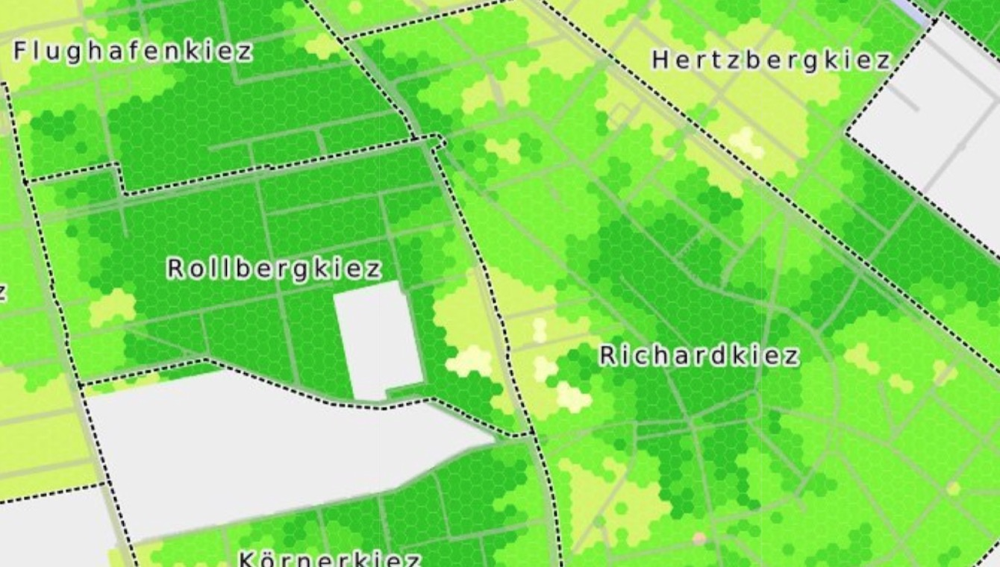
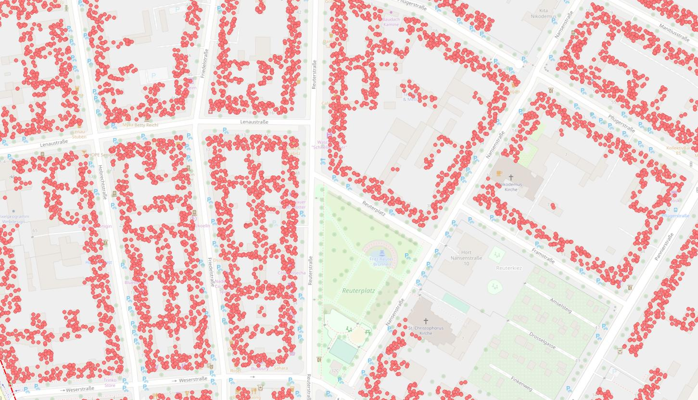
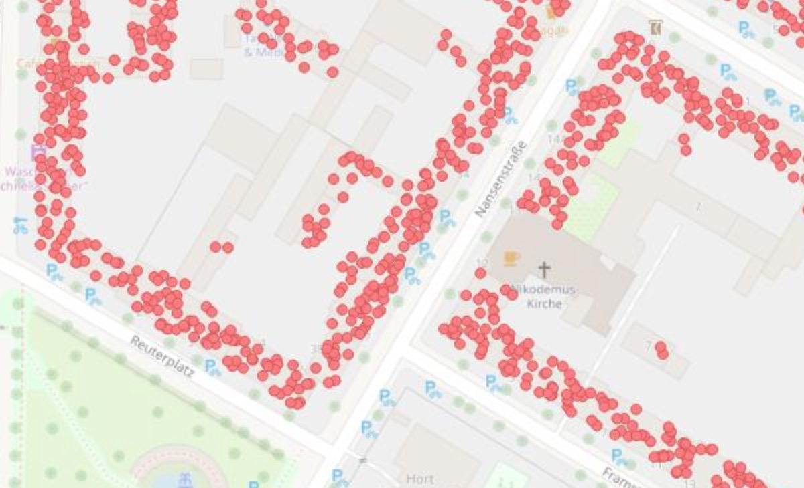

Dieser Blogpost ist zuerst [in @tordans' OpenStreetMap Blog veröffentlicht worden](https://www.openstreetmap.org/user/tordans/diary/396118). Dort kann man ihn auch [mit OSM-Account kommentieren](https://www.openstreetmap.org/user/tordans/diary/396118#newcomment).

Ein Interview von [Tobias @tordans](https://www.openstreetmap.org/user/tordans/) mit [Alex @Supaplex030](https://www.openstreetmap.org/user/Supaplex030/).

_Tobias:_ Hallo Alex, du arbeitest gerade an einem spannenden Projekt an der Schnittstelle von OSM und der Verkehrswende in Berlin, nämlich einer [Parkraumanalyse für den Ortsteil Neukölln](https://supaplexosm.github.io/strassenraumkarte-neukoelln/?map=parkingmap). Das ist sehr vielfältig – heute wollen wir uns ein Detail anschauen, bei dem es um OpenData und OpenStreetMap und die Verbindung von verschiedenen Datenquellen geht.

## Anzahl angemeldeter Autos pro Haus
{: class='mt-5 mb-3' }

**Eine Zielsetzung dabei ist, herauszufinden wie viele Autos in einem Häuserblock angemeldet sind.** Dafür gibt es keine direkten Daten, aber es gibt Daten über die man Näherungswerte schaffen kann mit Hilfe von anderen OpenData-Quellen und OSM. Und diese Daten hast du dann später in der Auswertung verwendet, über die wir auch noch mal an anderer Stelle sprechen: Eine Karte, in der visualisiert wird, wie viele Parkplätze pro Auto es im Umkreis eines Ortes gibt: [https://supaplexosm.github.io/strassenraumkarte-neukoelln/?map=parkingmap](https://supaplexosm.github.io/strassenraumkarte-neukoelln/?map=parkingmap)

{: class='img-fluid img-thumbnail' }

Die Karte zeigt anhand der Daten, die wir hier besprechen, wie hoch der “Parkdruck” pro Fläche sein müsste, wenn man alle verfügbaren Parkplätze darstellt und die Autos der Anwohner einrechnet. [Quelle Screenshot](https://supaplexosm.github.io/strassenraumkarte-neukoelln/?map=parkingmap#15/52.4772/13.4393)

_Alex:_ Genau, ich habe eine Stellplatzdichte-Verteilung ermittelt. Wie du schon sagst: Dafür habe ich verschiedene Daten verwendet, die auf verschiedenen räumlichen Ebenen vorliegen. Einmal die von dir angesprochenen Kfz-Daten, die habe ich auf Anfrage vom Amt für Statistik Berlin-Brandenburg auf LOR-Ebene bekommen, da es leider keine aktuelle Veröffentlichung dazu gab. LOR steht in Berlin für “Lebensweltlich orientierte Räume”. LOR sind im Prinzip Kieze, also kleine Stadtviertel, da wohnen ungefähr 10.000 bis 20.000 Menschen pro LOR. Das ist – glaube ich – die kleinste Einheit, auf der man die Daten mal eben bekommen kann.

## LOR-Daten zu Kfz-Anmeldungen
{: class='mt-5 mb-3' }

**_Tobias:_ Wie sehen die LOR-Daten aus, die uns zur Verfügung stehen?**

_Alex:_ Neben dem LOR-Namen, beispielweise “Schillerkiez”, enthalten die Daten verschiedene demografische Werte wie die Anzahl der Erwachsenen im Kiez und verschiedene Kfz-Zahlen. Vor allem die Gesamtzahl der zugelassenen Fahrzeuge, unterteilt in Pkw und sonstige Fahrzeuge – also gewerbliche Laster, Kleintransporter, Motorräder und ähnliches. Die Pkw machen ca. 80 Prozent aus, die sonstigen Fahrzeuge teilen sich zum größten Teil etwa gleich auf Kleintransporter und Motorräder auf. Nicht enthalten ist eine Unterscheidung in private und gewerblich genutzte Fahrzeuge, aber das brauche ich auch für meine Auswertung nicht, denn ich beziehe ja auch gewerblich genutzte Parkplätze mit ein. Die Daten sind übrigens von Juni 2020.

Zu den Daten: [Melderechtlich registrierte Einwohnerinnen und Einwohner am Ort der Hauptwohnung in Berlin am 30.06.2020 nach Planungsräumen und KfZ-Bestand](https://supaplexosm.github.io/strassenraumkarte-neukoelln/parkraumkarte/data#melderechtlich-reg-einwohner-berlin-mit-kfz)

## Daten vom LOR auf einzelne Gebäude runterbrechen
{: class='mt-5 mb-3' }

_Tobias:_ Wie hast du dann die Präzision der Daten vom Kiez auf Haus-Ebene erhöht?

{: class='img-fluid img-thumbnail' }

_Punktewolke zeigt Bewohner pro Haus – statistisch gesehen. [Quelle OpenStreetMap Wiki](https://wiki.openstreetmap.org/w/images/d/d4/Bev%C3%B6lkerungsdichte_Neuk%C3%B6lln_dot_sample.jpg)_

_Alex:_ Richtig, wir starten zunächst groß auf Kiez-Ebene, für die wir die Kfz-Daten haben. Eine Ebene darunter gibt es – zumindest in Berlin –  OpenData der Häuser-Block-Flächen. Sozusagen die Bereiche zwischen den Straßen, auf denen Häuser stehen. Zu diesen Blöcken gibt es Bevölkerungsdaten, die mir pro Block sagen, wie viele Menschen auf dieser Fläche wohnen.
Aber das ist immer noch nicht klein genug für meine Auswertung, denn das ist immer noch ein großer Block mit vielen Häusern, dazwischen auch unbewohnte Gebiete wie z.B. Kleingärten. Dank OSM und anderen OpenData-Datensätzen in Berlin habe ich aber Informationen über die einzelnen Gebäude im Block. Über diesen Weg kann ich die Daten von den Blockflächen nochmal runterrechnen auf die einzelnen Gebäude.
Dabei ist die Grundidee, dass man die statistisch gemeldeten Personen in einem Block auf die Gebäude verteilt, und zwar entsprechend ihrer Wohnfläche. Für jedes Gebäude kann ich anhand seiner Funktion, z.B. “Wohngebäude”, “Gewerbegebäude” oder eine Mischnutzung, und anhand seiner Stockwerkszahl ermitteln, wie viele Bewohner dort statistisch zu erwarten sind. Das ist also keine tatsächliche Zahl, die ich da vom Kingelschild abgelesen habe, sondern ich interpoliere das anhand der Gebäudedaten, die wir haben. Das gewünschte Ergebnis ist, dass ich für jeden Menschen im Gebäude einen Punkt habe. Und das entspricht mit einer relativ hohen Wahrscheinlichkeit dann der tatsächlichen Bevölkerungsdichte im Berliner Stadtraum.

## Von den Menschen zu den Autos
{: class='mt-5 mb-3' }

_Alex:_ Dieses Bevölkerungsmodell können wir jetzt nehmen und mit den Daten zu den angemeldeten Kfz kombinieren. Wenn ich weiß, wie viele Autos in einem Gebiet angemeldet sind, kann ich für jeden Menschen, also Punkt in unser Karte, angeben, mit welcher Wahrscheinlichkeit dieser Mensch ein Auto besitzt. Ich ordne jedem Menschen eine Zufallszahl von 1-100 zu und bei einer angenommenen Auto-Besitz-Quote von 20 Prozent ist dann jeder fünfte Punkt – statistisch gesehen – ein Autobesitzer.

_Exkurs:_ Mit dieser Herangehensweise könnte man noch viele andere, spannende Auswertungen von demografischen Daten machen, vielleicht auch noch eine genauere Zuordnung. Beispielsweise gibt es [Zensusdaten von 2011 im 100-Meter-Raster](https://www.zensus2011.de/DE/Home/Aktuelles/DemografischeGrunddaten.html).

{: class='img-fluid img-thumbnail' }

**_Tobias:_ Jetzt schauen wir gemeinsam das Ergebnis an:** Auf einer OSM-Karte sehen wir Gebäude und Punkte. Dahinter steckt die Umrechnung vom Kiez auf den Häuserblock, dann auf das Gebäude unter der Berücksichtigung einer Wahrscheinlichkeit anhand der Stockwerkzahl, Grundfläche und Funktion des Gebäudes. Also eine Karte der Bevölkerungsdichte, bei der jeder Mensch mit einem statistischen Punkt repräsentiert wird.

## OpenData in Berlin: ALKIS
{: class='mt-5 mb-3' }

_Tobias:_ Welche Rolle spielten bei der Auswertung OpenData-Quellen des Berliner Senats?

_Alex:_ Alles, was ich gemacht habe, wäre theoretisch mit OSM-Daten möglich gewesen. Aber da vor allem die Gebäudedetails in OSM nicht überall erfasst sind, habe ich für meine Auswertung Daten aus dem ALKIS der Stadt verwendet (Anmerkung: ALKIS: Amtliches Liegenschaftskatasterinformationssystem).

Für die Auswertung sind drei Faktoren entscheidend: Die Stockwerkzahl, die Funktion und die Grundfläche des Gebäudes.

In OSM – gerade in Neukölln – haben wir die Stockwerkzahl schon ziemlich gut erfasst. Auch die Grundfläche ist – auch hier dank der OpenData des Senats – sehr präzise erfasst. Aber gerade bei der Funktion erschienen mir die ALKIS-Daten vollständiger.

Ich habe daher die ALKIS-Daten als Basis genommen und an den Orten, von denen ich wusste, dass die OSM-Daten aktueller sind, die OSM-Grundrisse übernommen. Insbesondere bei Neubauten. Das ist nur möglich, weil die Daten in einer offenen Lizenz – auch OSM-kompatibel – vorliegen.

Datenquelle: [ALKIS Berlin (Amtliches Liegenschaftskatasterinformationssystem)](https://daten.berlin.de/datensaetze/alkis-berlin-amtliches-liegenschaftskatasterinformationssystem-wms)

**_Tobias:_ Welche Auswirkung hatte die Funktion eines Gebäudes für deine Auswertung?**

_Alex:_ Ich habe für die Berechnung nur Wohnflächen berücksichtigt. Auf der Karte sind daher überall dort Lücken, wo bspw, Kirchen, Schulen, etc. als Gebäudefunktion angegeben sind. Ebenso werden Hinterhöfe, Garagen, Gewerbegebäude, Kleingärten usw. ausgeschlossen. Bei reinen Wohngebäuden habe ich alle Obergeschosse des Gebäudes bei der Wohnfläche berücksichtigt. Bei der Kategorie “Wohngebäude mit Gewerbenutzung”, bei der typischerweise das Erdgeschoss gewerblich genutzt wird, habe ich entsprechend ein Stockwerk abgezogen. Bei der Kategorie “Gewerbegebäude mit Wohnnutzung” ist unklarer, wie viel davon bewohnt wird. Ich habe dann die Hälfte des Gebäudes angerechnet. Das war glücklicherweise nur ein kleiner Teil der Daten. Andere Kategorien, die eindeutig nicht als Wohnraum gedacht sind, habe ich ausgeschlossen.

Einen Teil der Kfz-Daten habe ich übrigens auf alle Gebäude verteilt, und nicht nur auf die Wohngebäude bzw. die Bewohner-Punkte, denn vor allem gewerblich angemeldete Fahrzeuge können ja auch einem unbewohnten Gebäude zugeordnet sein.

## QGIS
{: class='mt-5 mb-3' }

**_Tobias:_ Mit welcher Software hast du gearbeitet?**

_Alex:_ Ich habe alles [mit QGIS gemacht](https://www.qgis.org/de/site/). QGIS ist ein Geoinformationssystem – Open Source und frei. Da habe ich die Block- und Gebäudedaten aus ALKIS und OSM eingeladen, verarbeitet und die Bevölkerungswerte daraus berechnet. Als Ergebnis bekomme ich dann eine Zahl pro Gebäude, wie viele Menschen hier statistisch zu erwarten sind. Am Ende kann man zufällig genau so viele Punkte über das Haus verteilen wie Menschen dort wohnen, um die Daten sozusagen auf die individuelle Ebene zu bringen.

## Wohnen im Kleingarten oder Industriegebiet
{: class='mt-5 mb-3' }

**_Tobias:_ Was haben wir bisher vergessen?**

_Alex:_ Ein interessantes Detail ist, dass ich in einem Kontrollschritt festgestellt habe, dass ich 450 Menschen weniger hatte als tatsächlich in Neukölln leben. Dann ist mir aufgefallen, dass es Häuserblöcke gibt, in denen ich keine Wohngebäude identifiziert und berücksichtigt habe, aber wo tatsächlich Menschen gemeldet sind. Beispielsweise ein einem Kleingartenareal, wo ich erstmal keine Bevölkerung angenommen habe, da man dort meines Wissen nicht wohnen darf. Aber vermutlich haben einige Bewohner dort Bestandsschutz, so dass doch Menschen gemeldet sind. Die fehlenden Personen habe ich dann auf alle Gebäude verteilt.

**_Tobias:_ Vielen Dank, Alex, für diese interessanten Einblicke!**

In einem nächsten Interview schauen wir auf ein Nebenprodukt deiner Auswertung, die Straßenraumkarte für Neukölln mit einem Schwerpunkt auf Micromapping und Karten-Rendering. Und beides zusammen kann man sich auch schon jetzt anschauen unter [https://supaplexosm.github.io/strassenraumkarte-neukoelln/?map=parkingmap](https://supaplexosm.github.io/strassenraumkarte-neukoelln/?map=parkingmap).
