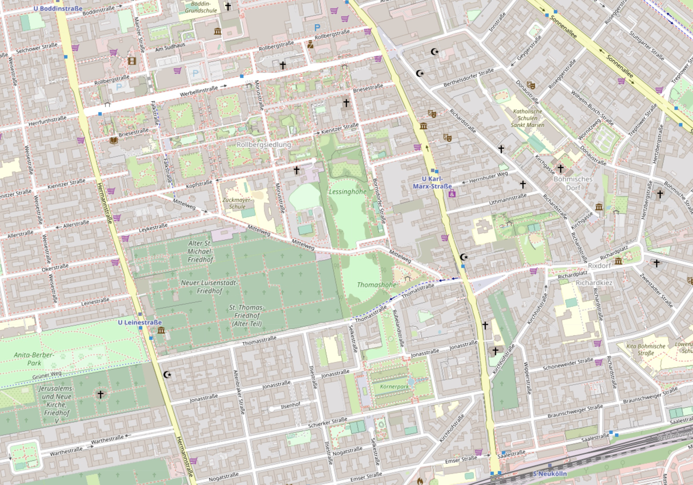
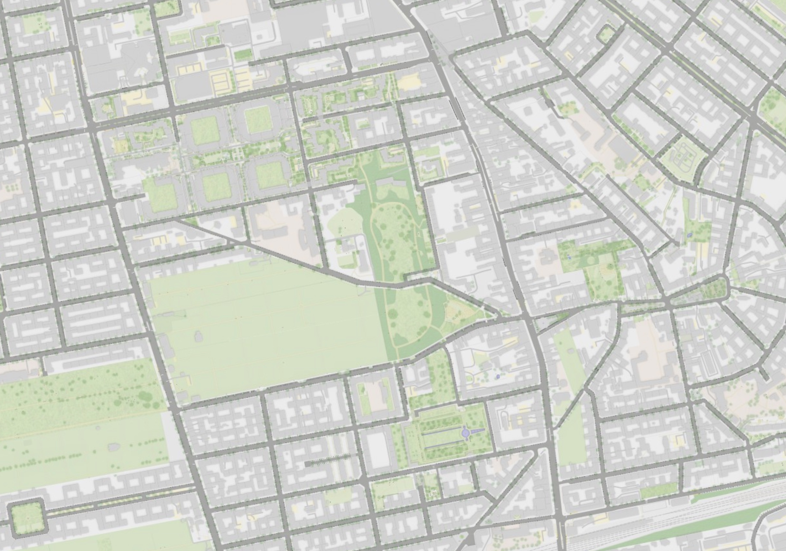
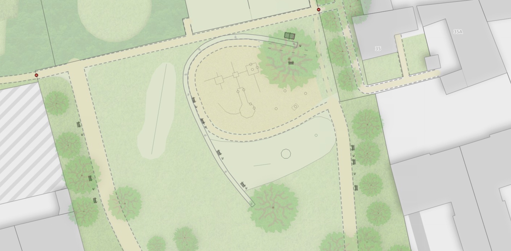
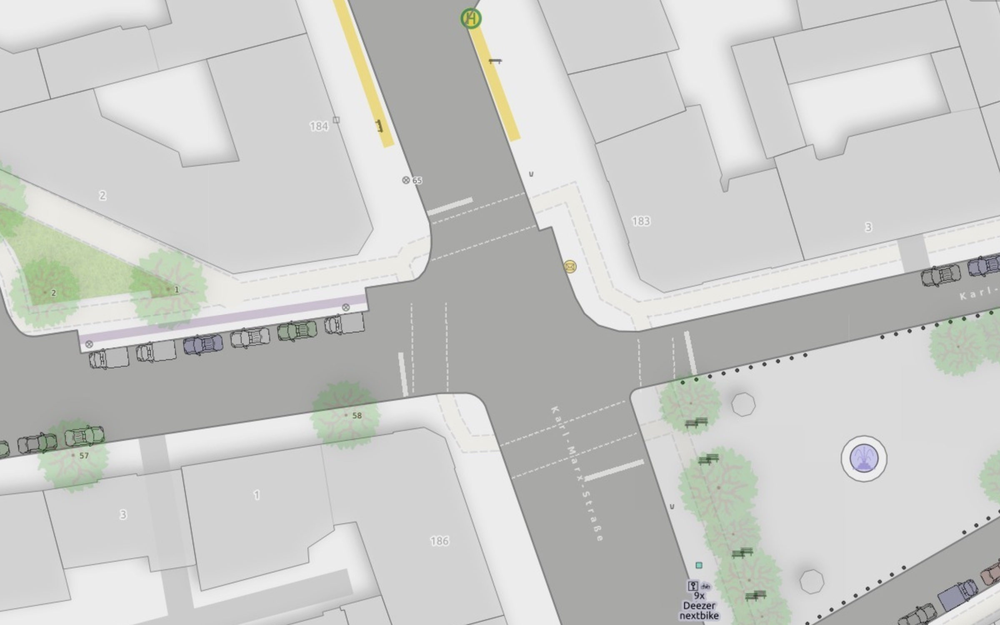
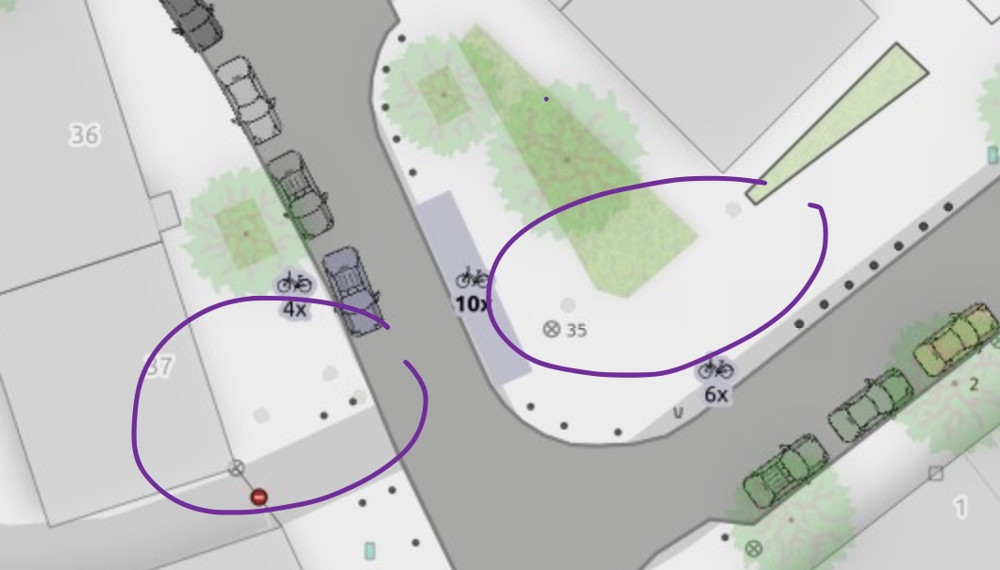
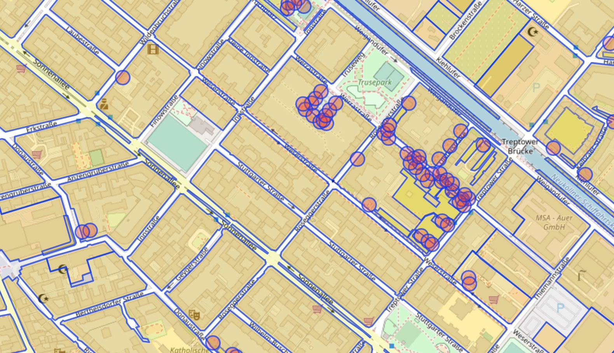

Dieser Blogpost ist zuerst [in @tordans' OpenStreetMap Blog veröffentlicht worden](https://www.openstreetmap.org/user/tordans/diary/397212). Dort kann man ihn auch [mit OSM-Account kommentieren](https://www.openstreetmap.org/user/tordans/diary/397212#newcomment).

{: class='img-thumbnail' }

_Tobias:_ Hallo Alex, das ist unser Teil 2 auf dem Weg zur Beschreibung [deiner größeren Parkraum-Analyse](https://supaplexosm.github.io/strassenraumkarte-neukoelln/posts/2021-03-12-parkraumanalyse). In Teil 1 haben wir uns angeschaut, wie du [mit Hilfe verschiedener OpenData-Quellen ein Bevölkerungsmodell und Autobesitzer-Modell auf Häuser-Ebene erstellt](https://supaplexosm.github.io/strassenraumkarte-neukoelln/posts/2021-03-13-opendata) hast.

Jetzt schauen wir uns ein anderes Nebenprodukt an:

## Eine Karte von dem Ortsteil Neukölln in einem ganz eigenen Kartenstil.

Das ist die erste Karte, die ich so kenne, bei der die parkenden Autos anhand des [Parking-Lane-Schemas von OSM](https://wiki.openstreetmap.org/wiki/Key:parking:lane) visualisiert sind. Das gibt der Karte gleich einen ganz anderen Informationsgehalt und auch eine andere Stimmung. Darüber hinaus gibt es weitere Gestaltungsentscheidungen, die ich spannend finde, über die wir jetzt sprechen.

{: class='img-fluid' }

{: class='img-fluid' }

_Screenshot: Vergleich bei Zoomstufe 16 zwischen dem [OSM Standard-Kartenstil](https://supaplexosm.github.io/strassenraumkarte-neukoelln/?map=osm#16/52.4749/13.4376) und [der Straßenraumkarte](https://supaplexosm.github.io/strassenraumkarte-neukoelln/?map=micromap#16/52.4749/13.4376)_

## Was macht den Kartenstil besonders?

_Tobias:_ Was ist an diesem Kartenstil aus deiner Sicht grundsätzlich anders als bei der Standard-OSM-Karte oder bei anderen bekannten Karten?

_Alex:_ Du hast ja schon erwähnt, die Autos sind auf jeden Fall etwas besonderes. Das ist ein Ziel dieser Karte gewesen: die parkenden Autos und die Straßen im Straßenraum darzustellen. Sie stellt aber auch **sehr präzise die Straßenraumaufteilung dar**. Und dafür ist insbesondere die Bordsteinkanten-Information sehr relevant. Straßen sind – wie normalerweise in Karten – nicht einfach nur Linien mit einer generischen Breite. Stattdessen zeige ich die real existierenden Fahrbahnflächen: Mit Rundungen im Kreuzungsbereich, mit Gehwegvorstreckungen und mit sonstigen speziellen Formen und Abweichungen, die es in der Realität gibt. Davon lebt diese Karte auch und ich stelle es mir relativ schwierig vor, diesen Kartenstil ohne diese Bordstein-Informationen zu erzeugen. Man könnte zwar generische Straßenbreiten annehmen, das habe ich auch in dem Modell für die Parkraum-Analyse so gemacht. Das funktioniert relativ gut, solange die präzise Darstellung unwichtiger ist. Aber da es hier wirklich darum geht, eine sehr hohe Präzision in der Straßenraumaufteilung darzustellen, ist die generische Straßenbreite keine Lösung. In meiner Darstellung kann man beispielsweise sehen, wenn ein Poller zwanzig Zentimeter vom Bordstein entfernt steht.

_Tobias:_ Lass uns gleich nochmal im Detail auf die Bordsteine schauen. Vorab aber: Welche anderen kleinen Details fallen dir ein, die sich lohnen hervorgehoben zu werden?

## Urbanes Micro-Mapping

_Alex:_ Das meiste ergibt sich aus den OSM-Daten, in die alle Aktiven in Neukölln viel Liebe reinstecken. Das ist auch ein Alleinstellungsmerkmal dieser Karte, sie lebt davon, dass die Datengrundlage sehr gut und präzise ist. Ich nenne das immer „urbanes Micro-Mapping", was wir hier in Neukölln betreiben. Dieses Mikro-Mapping wird in Berlin zum Glück vereinfacht, weil wir gute, externe Datensätze von der Stadtverwaltung haben – mit einer OSM-kompatiblen Lizenz –, mit denen wir die _on the ground_ vorgefundenen Dinge zuhause am Computer sehr präzise verorten können. Und die Daten sind wirklich zentimetergenau. Das merkt man zum Beispiel an diesen Bordsteinkanten.

## Spielplätze

Was mir persönlich sehr gut gefällt in der Karte, sind die Visualisierungen auf Spielplätzen. Ich habe beispielsweise die Spielgeräte angedeutet. Ich träume schon seit längerem von so einer Art Spielplatzkarte, auf der man den Spielplatz mit seinen Schaukeln und Mülleimern in eine Art Übersichtsplan sehen kann.

{: class='img-thumbnail' }

_Screenshot: Spielplatz zwischen Karl-Marx-Platz und Richardplatz mit ausgerichteten Bänken, Wegen, Sandkasten und angedeuteten Spielgeräten. [Zum Kartenausschnitt](https://supaplexosm.github.io/strassenraumkarte-neukoelln/?map=micromap#18/52.47441/13.44345)_

## Fahrbahnmarkierungen

Ein weiteres Detail sind die Fahrbahnmarkierungen. Es gibt zum Beispiel Zebrastreifen und Haltelinien vor Ampeln oder Stoppschildern. Gut gefallen mir auch die Gehweg- und Radwegfurten. Ist alles noch etwas provisorisch und es fehlen viele Markierungen, ist aber schonmal ein nettes Detail. Ich plane mittelfristig dann auch Fahrspuren, Turn Lanes und soetwas einzubauen. Gleichzeitig merkt man bei den Haltelinien auch, dass man bei der Darstellung an Grenzen stößt, gerade was die Ausrichtung angeht. Ich habe mir ein Tagging-Schema ausgedacht, um einer Haltelinie neben ihrer bereits erfassten Position auch einen Winkel zuzuordnen, wenn sie nicht rechtwinklig zum Straßenverlauf ist. So dass man sagen kann, die Haltelinie in dieser Straße ist z.B. im Winkel von 168 Grad ausgerichtet. Das ist dann in so einer Visualisierung sehr wertvoll. Gerade bei spitzwinklig aufeinandertreffenden Straßen.

{: class='img-thumbnail' }

_Screenshot: Haltelinien und Fußgängerübergänge; [zum Kartenausschnitt](https://supaplexosm.github.io/strassenraumkarte-neukoelln/?map=micromap#20/52.47376/13.44062)_

## Bäume

_Tobias:_ Die Bäume sind mir auch aufgefallen. Du hast die transparent dargestellt und auch die Kronen in verschiedenen Durchmessern. Wie ist das gebaut?

_Alex:_ Es gibt einzelne Bereiche in Neukölln, wo die Kronendurchmesser tatsächlich in den OSM-Daten stecken. Z.B. habe ich vor ein paar Jahren mal [einen Abgleich mit den Baumkatasterdaten des Senats gemacht](https://wiki.openstreetmap.org/wiki/User:Supaplex030/Baumabgleich) und in diesem Zuge den Kronendurchmesser auf Basis von belaubten Orthofotos für vierhundert Bäume eingetragen. Bei den meisten Bäumen kann man den Durchmesser aber nicht aus bestehenden Daten ableiten. Ich habe für die Darstellung daher einen durchschnittlichen Zufallswert als Durchmesser genommen. Ein Nebeneffekt dieser Technik ist, dass ein Baum auf verschiedenen Zoom-Stufen einen unterschiedlichen Kronendurchmesser haben kann – das ist noch nicht ganz perfekt.

## Architektur-Karten

Aber trotz dieser kleinen Fehler passen die halbtransparenten und unterschiedlichen Bäume gut in den etwas verspielt-realistischen Stil der Karte. Ich habe mich dabei an Architektur-Karten orientiert, die ja auch mit so einem pseudo-realen Stil daherkommen. Daher sehen auch die Bänke ein bisschen aus wie Bänke.

## Autofarbe

_Tobias:_ Welche Bedeutung haben die Farben der Autos?

_Alex:_ Die Farbe der Autos hat keine Bedeutung. Es gibt [in der Parkraumkarte](https://supaplexosm.github.io/strassenraumkarte-neukoelln/?map=parkingmap#19/52.48074/13.43222) auch einen Layer, in dem sie nur als farbige Blöcke dargestellt sind. Für die Straßenraum-Karte haben sich die Autos aber harmonischer ins Bild gefügt, wenn es mehr als ein Modell gibt – ich wechsele drei Modelle ab – und auch die Farbe wechselt.

## Gullideckel

_Tobias:_ Welches anderes Detail der Karte möchtest du noch erwähnen?

_Alex:_ Wenn du schon so fragst … – Es gibt Gullideckel. [Beispielsweise in der Nähe von “Am Sudhaus”](https://supaplexosm.github.io/strassenraumkarte-neukoelln/?map=micromap#20/52.47935/13.43015). Die fallen zwar gar nicht auf, und es gibt auch relativ wenige Gullideckel in OSM, aber sie werden tatsächlich auch gerendert. Die Textur ist genau dieselbe wie im Computerspiel Cyperpunk 2077 (dort gibt es sogar [eine Petition dazu](https://www.change.org/p/the-cyberpunk-developers-fix-the-manhole-covers-in-cyberpunk-2077)) – nur dass man das in dieser Größe in der Straßenraumkarte nicht erkennen kann ;-).

{: class='img-thumbnail' }

_Screenshot: Vier Gullideckel als graue Flächen auf der Straße. [Zum Kartenausschnitt](https://supaplexosm.github.io/strassenraumkarte-neukoelln/?map=micromap#20/52.47509/13.44464), [Beispiel OSM Node](https://www.openstreetmap.org/node/8319956323), [Overpass Turbo für Gullideckel](https://overpass-turbo.eu/s/18Ab)_

## Bordsteinkante

_Tobias:_ Lass uns nochmal detaillierter über die Bordsteinkante sprechen. Sie umschießt in deiner Darstellung – je nach Sichtweise – entweder den Häuserblock oder die Fläche der Straße. Für mich ist das eines der wichtigsten Elemente der Karte.

{: class='img-thumbnail' }

_Screenshot: Overpass Turbo für alle Flächen mit landuse-Wert, [https://overpass-turbo.eu/s/14lo](https://overpass-turbo.eu/s/14lo)_

In Berlin haben wir für so eine Darstellung schon gute Vorarbeit geleistet, da in einigen Bereichen die Bordsteinkante als Grenze für eine <code>landuse=residential</code> (…) Fläche verwendet wird. Diese Praxis hat aber auch Nachteile.
Wie bist du vorgegangen?

_Alex:_ Tatsächlich ist mein Ziel, die Bordsteindaten mittelfristig komplett auf OSM zu basieren.
Zur Zeit sind diese Daten aber eine Mischung aus OSM und ALKIS-Daten aus dem Berliner Geoportal. Die ALKIS-Daten haben den Vorteil, dass sie sehr präzise und vollständig sind. Sie haben aber an einigen Stellen den Nachteil, dass sie weniger aktuell sind als OSM – und in QGIS bin ich bei ihnen auf sehr viele Geometriefehler gestoßen, die die Verarbeitung erschweren. Ich haben daher einen manuellen, “handkuratierten” Datensatz erstellt, bei dem ich ALKIS-Daten mit OSM-Daten angereichert, aktualisiert und korrigiert habe.
Das zu bauen ist Handarbeit, und ich versuche es gerade parallel aktuell zu halten. Änderungen an den Bordsteinen pflege ich also zur Zeit in meinen Datensatz nach.
Ideal wäre, wenn wir in Neukölln den Bordstein mit barrier=kerb erfassen würden. Dann könnte ich komplett auf ALKIS-Daten verzichten.
Wenn wir das einmal umgesetzt hätten, könnten wir auch die Berliner Praxis, landuse=residential an der Bordsteinkante enden zu lassen, verabschieden. Für mich wäre ideal, wenn die landuse-Fläche auch dort endet, wo real das Grundstück endet – am Zaun oder an der Mauer. Der Bürgersteig ist dann gedanklich eine andere landuse-Fläche – wobei man das für meine Karte gar nicht einzeln erfassen muss. Überhaupt kommt die Darstellung vollkommen [ohne das <code>area:highway</code>-Schema](https://wiki.openstreetmap.org/wiki/Key:area:highway) aus.

## Wie die Autos ihre Parkposition finden …

_Tobias:_ Lass uns nochmal auf die Autos schauen. Die Information, ob Autos in der Straße parken, bekommst du [vom <code>parking:lane</code> Schema](https://wiki.openstreetmap.org/wiki/Key:parking:lane). Aber wie platzierst du die Autos richtig an der Bordsteinkante?

_Alex:_ Die richtige Positionierung war tatsächlich die größte Arbeit. Ursprünglich hatte ich ja vor, diese Parkraumanalyse komplett mit generischen Daten zu machen. Beispielsweise 11m oder 15m Breite je nach Straßentyp anzunehmen. Aber: Wenn man das in einer hochaufgelösten Karte mit “echten” Fahrbahnflächen darstellt, stehen die Autos natürlich irgendwo chaotisch mitten auf der Straße oder halb auf dem Bordstein. Damit gehen visuelle Informationen wie die genaue Position der Autos, z.B. beim Parken auf (<code>on_kerb</code>) oder halb (<code>half_on_kerb</code>) auf dem Bordstein, verloren. Deswegen habe ich mir die Arbeit gemacht, die erzeugten Linienelemente an die Bordsteine zu snappen. Mit QGIS kann ich die Parkspuren über eine Snapfunktion an die nächstgelegene Bordsteinkante legen. Das funktioniert in den meisten Fällen sehr gut – und die Fehler und Sonderfälle musste ich manuell nachbearbeiten. Trotz dieser Hilfe von QGIS habe ich an diesem Feature bestimmt anderthalb Tage gesessen und stundenlang alles nachbearbeitet und geprüft.
Ich könnte mir aber gut vorstellen, dass es für eine reine systemische Parkraumanalyse – bei der die Visualisierung nicht im Vordergrund steht – absolut ausreichend ist, solche Details wegzulassen.

## Wie die Karte technisch generiert wird

_Tobias:_ Wir haben eben schon kurz über die Technik gesprochen, die du zum generieren der Karte verwendest. Bitte fass uns nochmal zusammen, welche Schritte du durchläufst.

_Alex:_ Ich muss gestehen, dass es technisch, glaube ich, relativ unausgereift ist, weil ich kein GIS-Profi bin, sondern im Prinzip mit der Parkraumanalyse in dieses ganze GIS-Umfeld reingewachsen bin. Deswegen ist das alles so nicht besonders elegant oder teils auch händisch gelöst – aber es funktioniert :-).
Der erste Bestandteil ist der handkuratierte Bordstein-Layer, über den wir schon gesprochen haben.
Dann hole ich mir zur Zeit noch über Overpass die aktuellsten OSM-Daten. Das müsste man eigentlich dringend auf eine PostGIS-Datenbank mit dem aktuellen OSM-Extract umstellen.
Einzelne dieser Daten laufen dann durch ein Post-Processing-Script, um sie für die Karte aufzubereiten. Dazu gehören beispielsweise die Ausrichtung von Gehwegübergängen oder Zebrastreifen oder die Haltelinien. Dieses Script ermittelt beispielsweise den Winkel, in dem ich einen Zebrastreifen darstellen muss anhand des Straßenverlaufs. Ein weiteres Detail ist, dass ich Hausnummern etwas versetzen muss, damit sie gut lesbar bleiben. Oder ein Filter, der bestimmte [<code>building:part</code>](https://wiki.openstreetmap.org/wiki/Key:building:part) einschließt und weniger relevante verwirft.
Daraus entstehen in QGIS jede Menge Layer von allen möglichen Objekten, die ich zur Anzeige des Kartenstils in QGIS verwende.
Zum Schluss exportiere ich aus QGIS die Kartenkacheln und lade sie manuell auf meinen Server.
Ich wäre sehr daran interessiert, das ganze stärker zu automatisieren …

## Ein Kartenstil für ganz Deutschland?

_Tobias:_ Das beantwortet auch meine nächste Frage, ob wir diesen Stil für ganz Berlin, Deutschland oder die Welt generieren können … – Nein, weil die Karte von Details lebt, die man so nicht mal eben aus OpenStreetMap rausziehen kann.

_Alex:_ Genau. Erstens das, also es lebt von diesem hohen Mikromapping-Grad, den wir in Neukölln haben. Wir haben ja eine super aktive Community, die auch dank der externen Daten, die wir in Berlin haben, einen super Datensatz produziert hat.
Aber es lebt eben auch von den Bordsteinkanten, die man erstmal erzeugen müsste.
Für Berlin ist das vielleicht noch möglich, wenn man sich da mal eine Weile ransetzt … aber für Deutschland geht es das erstmal nicht.

## Wunsch an Mapper\*innen: Mikro-Mapping

_Tobias:_ Zum Abschluss: Was wäre dein Wunsch an Mapper\*innen? Was wünschst du dir für diese Karte; was soll noch erfasst werden?

_Alex:_ Ich kann nur grundsätzlich zum Mikro-Mapping aufrufen. Damit meine ich jetzt nicht unbedingt, dass man seine Zeit damit verbringt, jede kleine Hecke zu kartieren, sondern auch die Tiefe der Daten an bestehenden Objekten erhöht. Zum Beispiel bei einer Sitzbank – da machen das die meisten auch – die Rücklehne und Ausrichtung mit erfassen. Das sind Dinge, die man auch in so einer Karte visualisieren kann – mal abgesehen davon, dass diese Informationen für einige Menschen natürlich einen ganz praktischen Nutzen haben können. Weitere Details, die sich gut visualisieren lassen, sind alle Objekte im Straßenraum wie Straßenlaternen, Fahrradständer, Poller, Schaltkästen…, aber auch Spielplatzgeräte oder eben Bäume mit ihrem Kronendurchmesser.

_Tobias:_ Herzlichen Dank, Alex, für diese Einblicke und diesen sehr schönen und nützlichen Kartenstil.

_Alex:_ Gerne.

## Update

Es hat jetzt leider einige Monaten geduert, bis dieses Interview veröffentlicht wurde. Seit dem ist noch einiges passiert in der Straßenraumkarte. Hier ein Ausschnitt an Features, die jetzt ebenfalls visualisiert werden:

- (Beta) Markierte Gehwegübergänge (Zebrastreifen, Ampelkreuzungen) sowie Haltelinien an Ampeln und Stoppschildern [Beispiel](https://supaplexosm.github.io/strassenraumkarte-neukoelln/?map=micromap#20/52.46682/13.43584)
- Querungsstellen mit randseitiger Schutz-Markierung und Sperrzonen auf der Fahrbahn sicht sichtbar [Beispiel](https://supaplexosm.github.io/strassenraumkarte-neukoelln/?map=micromap#20/52.47778/13.44358)
- Separat gemappte Gehwege werden als halbtransparente Linie dargestellt [Beispiel](https://supaplexosm.github.io/strassenraumkarte-neukoelln/?map=micromap#20/52.47752/13.42628)
- Schwebende Gebäudeteile/Gebäudegrundflächen ergänzen die bestehenden Gebäude-Geometrien [Beispiel](https://supaplexosm.github.io/strassenraumkarte-neukoelln/?map=micromap#20/52.48197/13.43342)
- Einzeln erfasste Parkplätze inkl. barrierefreien Stellplätzen werden dargestellt [Beispiel](https://supaplexosm.github.io/strassenraumkarte-neukoelln/?map=micromap#20/52.47464/13.45542)

Weitere Features sind angedacht, wie Straßen- und Abbiegespurmarkierungen oder eine bessere Visualisierung von Radwegen, insbesondere geschützten Radwegen.
