Our [last blog post (German) about the "Straßenraumkarte" (public space map)](https://supaplexosm.github.io/strassenraumkarte-neukoelln/posts/2021-07-18-strassenraumkarte) is a few month old now. Alex continued to improve his map with even more attention to detail.

This blog post will look at those details, showing example screenshots and referencing the (micro) mapping practices – the tags – required to generate such an exquisite map. It is written by Tobias [@tordans](https://www.openstreetmap.org/user/tordans) with Alex’ [@Supaplex030](https://www.openstreetmap.org/user/Supaplex030) input and review.

## An experimental map for Neukölln

As a reminder, this map is part of the [Berlin OSM Verkehrswende UserGroup](https://wiki.openstreetmap.org/wiki/Berlin/Verkehrswende) (user group OSM "traffic evolution"). It is an experiment, focussed on showcasing how detailed mapping of urban environment and street lane infrastructure – especially for bike and foot traffic – can be done with OSM.

It is only available for the district of Berlin Neukölln since it requires a very high detail of mapping in the area and the pre-processing script is optimized for experimentation and details, not scale.

## Bike lanes: Show them in detail…

Bike lanes are now rendered right where you would find them on the street. And with marking, color and separation details.

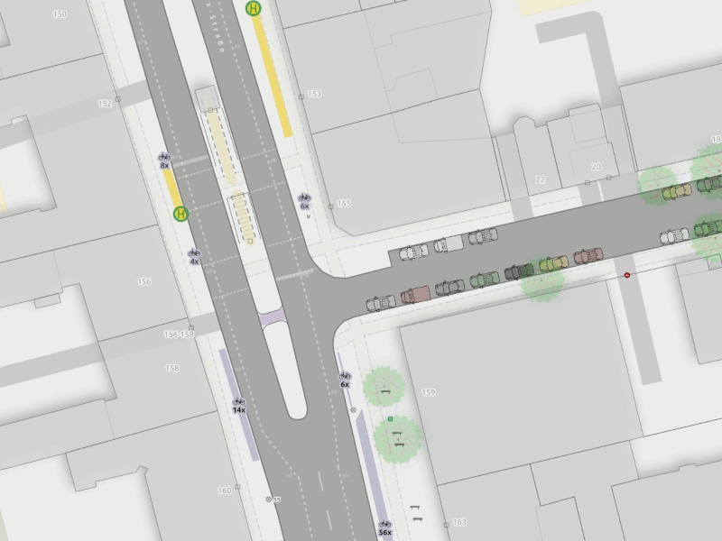

_Location: https://supaplexosm.github.io/strassenraumkarte-neukoelln/?map=micromap#20/52.47597/13.43957_

Most of the micromapping involved for bike lanes is documented [in our work in progress wiki page (German)](https://wiki.openstreetmap.org/wiki/Berlin/Verkehrswende/Radwege) and the [work in progress proposal page for `cycleway:separation` (English)](https://wiki.openstreetmap.org/wiki/Proposed_features/cycleway:separation). Most importantly, we show …

- Surface color where present, mainly `highway=cycleway + surface:colour=red|green`.
- Line marking and separation, mainly: `highway=cycleway + separation:left|right=solid_line|dashed_line|bollard` and `buffer:left|right=<m>`.
- Cycleway `width`, where specified.

Those are the tags used for separately mapped cycle ways, the wiki page shows examples for mapping on the main lane.

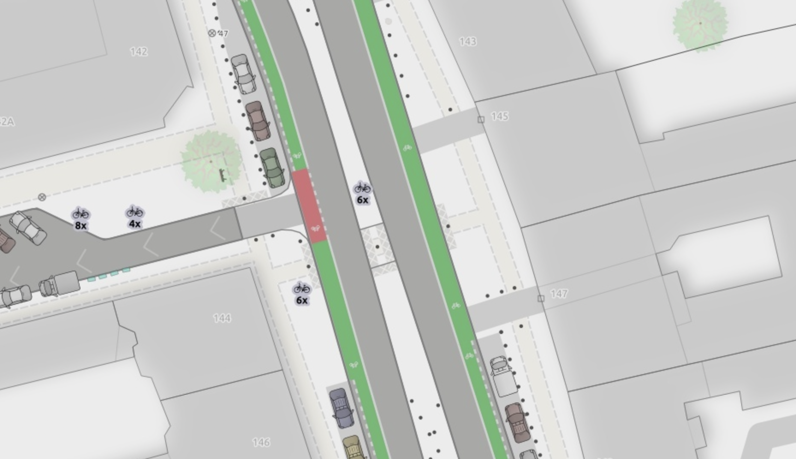

_Karl-Marx-Str. – Bicycle lane with unmarked pedestrian crossing and cars parked street side. https://supaplexosm.github.io/strassenraumkarte-neukoelln/?map=micromap#20/52.47663/13.43930_

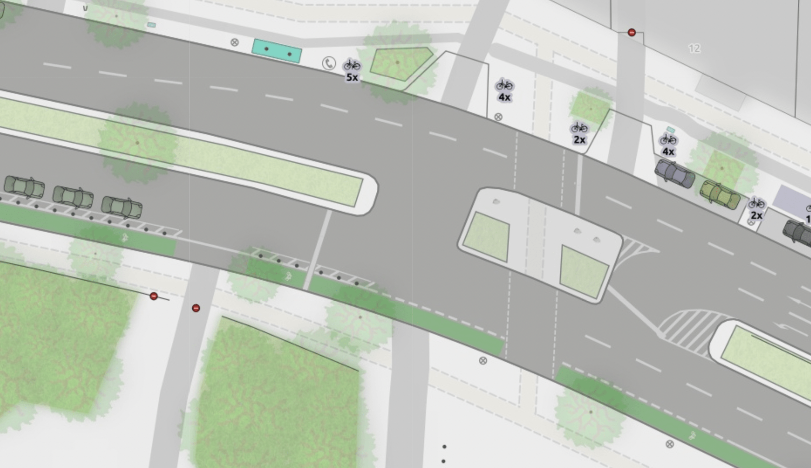

_Hasenheide – Protected bike lane. https://supaplexosm.github.io/strassenraumkarte-neukoelln/?map=micromap#20/52.48721/13.42120_

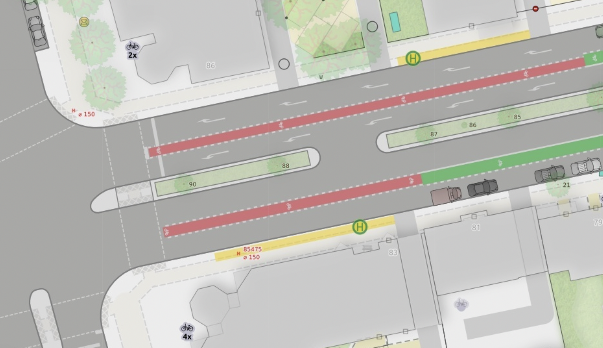

_Webellinstraße – Bicycle lane between car lanes with the stop position for bikes different from cars. https://supaplexosm.github.io/strassenraumkarte-neukoelln/?map=micromap#20/52.47761/13.42673_

## Bike lanes: Position them right…

The map shows separately mapped, physically separated cycleways (mapped as a separate way next to the road).

But more importantly, it shows those cycleways that are mapped on the main lane as well. This requires quite a bit of pre-processing to prepare the data for the map. This is a simple example: https://www.openstreetmap.org/way/986957310.

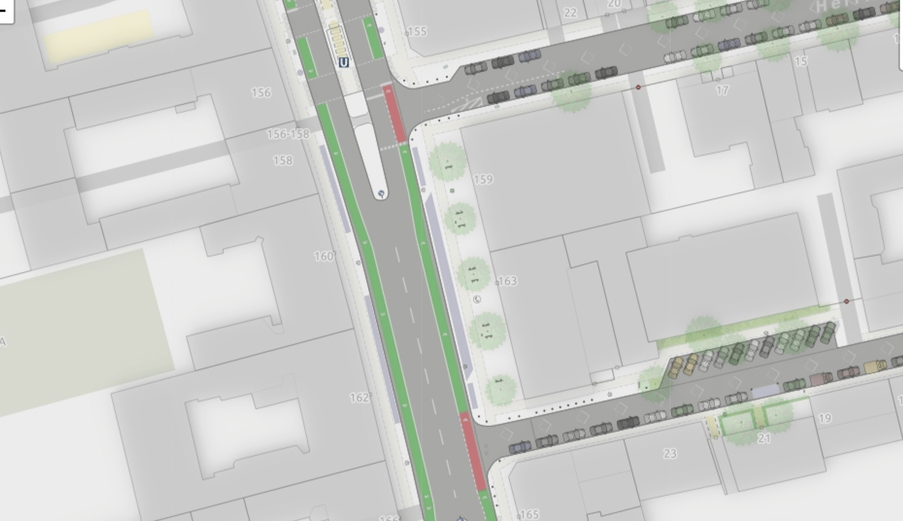

_https://supaplexosm.github.io/strassenraumkarte-neukoelln/?map=micromap#19/52.47546/13.44010_

1. `cycleway:both=lane` tells us to prepare cycleways on each side of this street. The cycleway separation- and surface-color-Tag specifies color and type of line marking.
2. `lanes=2` and `width:lanes:forward/backward=4.2` tells us the space that cars take up. Default lane width in our local area is 3 (meter), but sometimes it differs.
3. finally `lane_markings=yes` tells us to mark the middle of the road with a dashed line

As a result, the cycle ways can be placed left and right of the car lanes with high precision.

A more complex example is [way/413997566](https://www.openstreetmap.org/way/413997566):

_https://supaplexosm.github.io/strassenraumkarte-neukoelln/?map=micromap#20/52.47758/13.42699, [OSM](https://www.openstreetmap.org/way/413997566)_

To display this correctly, more information is required:

- Again, `lanes=2` tells us to look out for two car lanes (historically only counting car lanes, even if there are special lanes for cyclists)
- But `bicycle:lanes=no|designated|yes` and `vehicle:lanes=yes|no|yes` indicates that there are more traffic modes present than cars – an exclusive bike lane between the car lanes in this case (`cycleway:lanes=none|lane|none` makes it more explicit that this is a cycle lane). `turn:lanes=left|left;through|right` is used for rendering the turn lane arrows.
- In this case, we mapped the available space/lane width directly with `width:lanes=3|1.5|4` (car lane, cycle lane, car lane)
- Additionally, `placement=right_of:1` helps to place the lanes precisely in relation to position of the osm way by indicating that the way geometry is located right of the first (left) lane and all other lanes are to be rendered right of it.

Adding that information to the preprocessing allows us to render the map with a cycleway right where we find it on the road.

Processing all this correctly now makes up for about two thirds of the pre-processing script.

## Lane markings: Arrows left, right and center…

The map shows turn lane arrows on the lane. We already described the tagging required for this in the chapter above (`turn:lanes`). Here are a few examples of complex and nice map clippings:

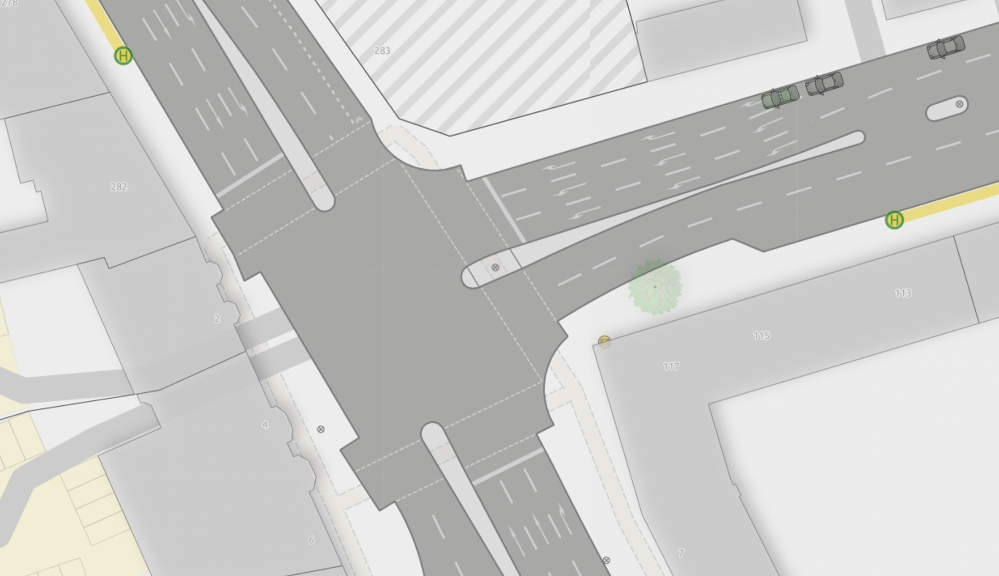

_https://supaplexosm.github.io/strassenraumkarte-neukoelln/?map=micromap#20/52.46369/13.44436_

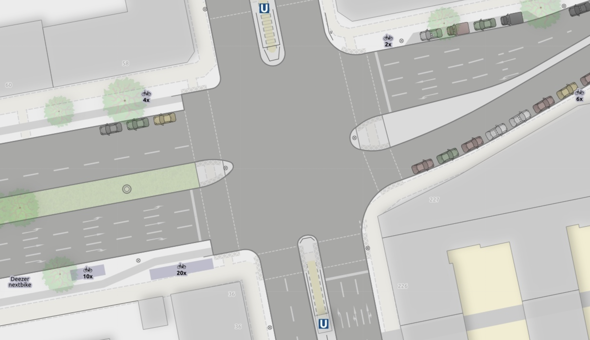

_https://supaplexosm.github.io/strassenraumkarte-neukoelln/?map=micromap#20/52.48072/13.42524_

## Lane markings: Buses only…

And while we are on the topic of painting on the lanes: Bus lanes are rendered with a "BUS" sign, based on `lanes=3 + lanes:psv=1`. Tagging Reminder: in this case – and in contrast to the cycle way lane described in the chapter above – the bus lane is counted as part of `lanes`-count.

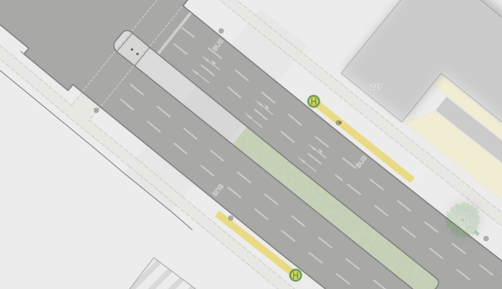

_https://supaplexosm.github.io/strassenraumkarte-neukoelln/?map=micromap#19/52.47255/13.45907, [OSM](https://www.openstreetmap.org/way/496201559)_

## Lane markings: Cases without a dashed line…

The map now shows lane markings as a dashed line in the middle of the road.

Respecting **`overtaking=no`** ([Wiki](https://wiki.openstreetmap.org/wiki/Key:overtaking)), of course, by showing this situation with a solid line – which happens once in the area of the map ;-).

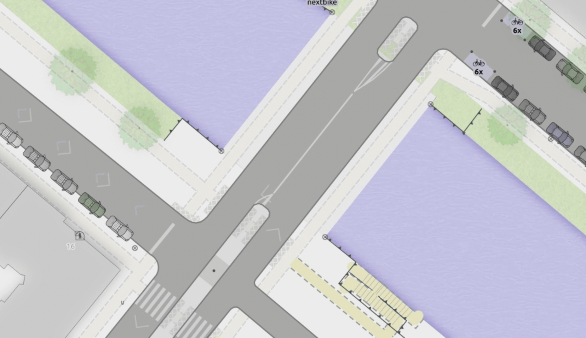

_https://supaplexosm.github.io/strassenraumkarte-neukoelln/?map=micromap#20/52.48491/13.44449_

Alex has plans to support the key `change` ([Wiki](https://wiki.openstreetmap.org/wiki/Key:change)) in the future.

Streets that have `lanes=2` but no marking are mapped with `lane_markings=no` and do not show any markings.

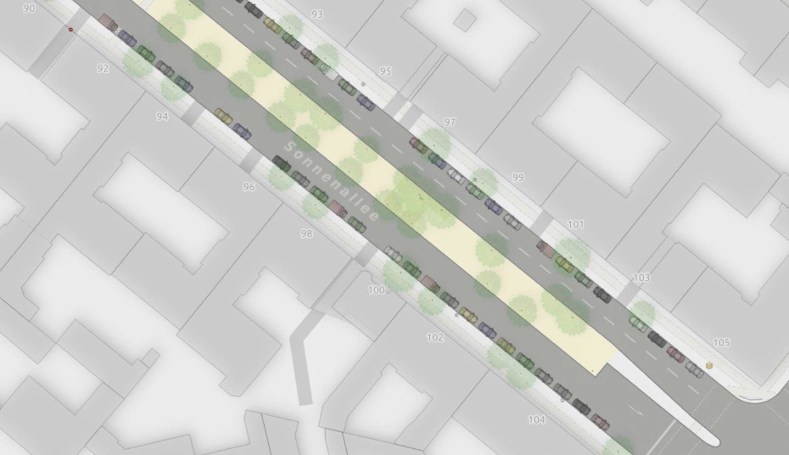

_https://supaplexosm.github.io/strassenraumkarte-neukoelln/?map=micromap#19/52.48220/13.43897_

## Lane markings: Traffic islands require very special treatment…

A key challenge for the correct rendering of lanes are situations, when lanes split to create room for eg. traffic islands. An example for such a situation is [way/954390045 at Hermannstraße (OSM)](https://www.openstreetmap.org/way/954390045) which flows around a [`traffic_calming=island` area (OSM)](https://www.openstreetmap.org/way/954421085).

Without any special treatment, the lanes would show up wrong (see Illustration, section "Rendering (lane markings)", left), since the OSM data is not optimized for renderers. The goal is to show the lane markings as going more or less straight past the traffic island (see Illustration, right).

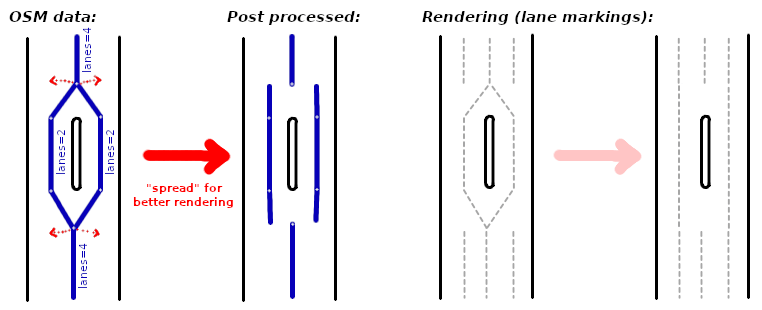

_Illustration: Spreading the OSM data to improve the rendering of lane markings for traffic islands during pre-processing._

To solve this problem, we first need to identify those lane segments that are part of a dual carriageway, but split during mapping. In Neukölln, we use the tag `dual_carriageway=yes` ([Wiki](https://wiki.openstreetmap.org/wiki/Key:dual_carriageway)) for this.

During pre-processing, the script can now check where a lane segment with `dual_carriageway=yes` connects to a lane segment without the tag and then split and spread the lane (see Illustration, section "Post processed").

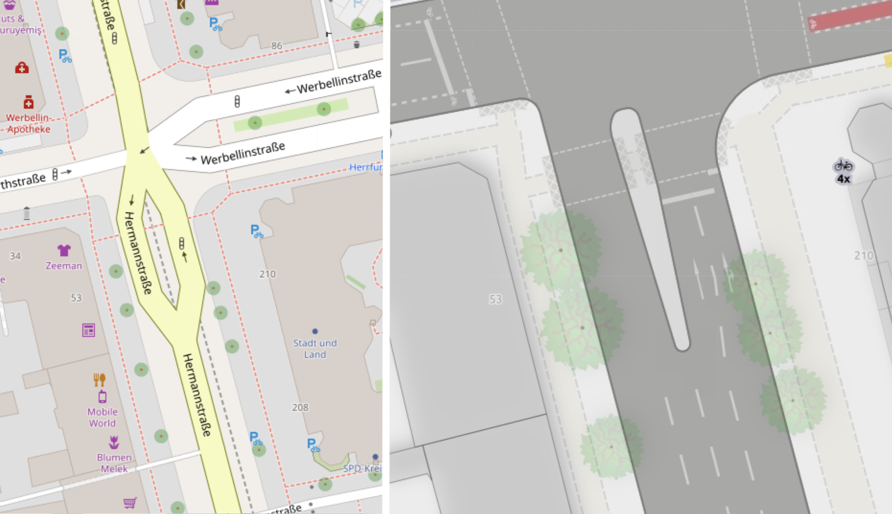

_https://supaplexosm.github.io/strassenraumkarte-neukoelln/?map=micromap#20/52.47746/13.42636, (OSM)[https://www.openstreetmap.org/way/954421085]_

## Junctions, an unsolved problem…

Getting junctions right based on OSM data is hard. Dustin Carlino of [ABStreet, an OSM based traffic simulation](https://github.com/a-b-street/abstreet), gives a good overview about the issues he has and workarounds he applies in [his recent StateOfTheMap 2021 Talk (Video, Starting ~12:30)](https://youtu.be/0_6IlkabE44?t=749).

The goal of Alex’ micro mapping map is to create a map based on OSM data that represents what we see in real life as closely as possible. For junctions, that has two parts: stop lines and lane/turn lanes.

**Stop lines:** For this experimental map and for this area, that is mapped in high detail, this problem is solved (see below).

**Lanes and turn lanes on the junction:** Unfortunately, this is still not solved. Below is a list of experiments that solve part of this problem. But they are complex to map and are touching (or crossing?) the border to be "tagging for the renderer".

### The issue with junctions

This is, what a junction without special treatment looks like:

- The lane markings are a mess of crossing lines inside the junction
- Cycleways need special treatment in those situations

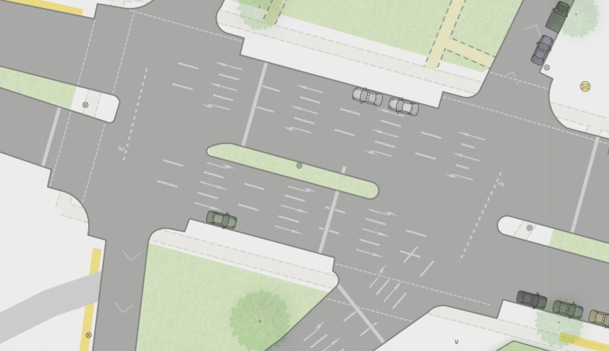

_https://supaplexosm.github.io/strassenraumkarte-neukoelln/?map=micromap#20/52.49391/13.40319_

For comparison, let’s have a look at this junction on an aerial image:

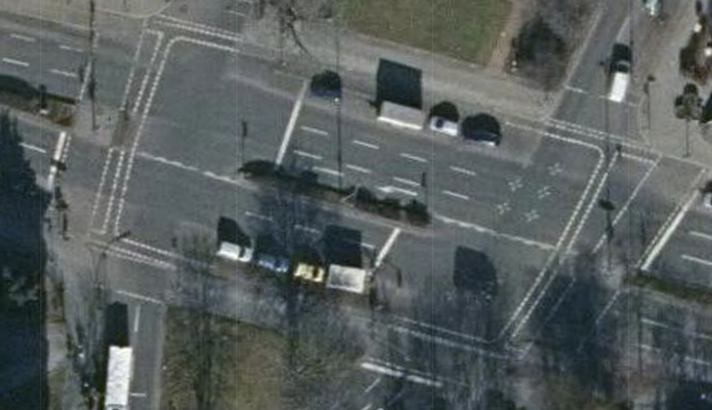

_https://supaplexosm.github.io/strassenraumkarte-neukoelln/mapproxy_demo_map.html?url=https://mapproxy.codefor.de/tiles/1.0.0/2021/mercator/{z}/{x}/{y}.png)#20/52.49391/13.40319 (which is a demo URL for https://luftbilder.berlin.codefor.de/)_

### For now, cut out junctions with `area:highway`

Alex’ solution for the given issues is to not render any lane markings for junctions. To specify the cut out area, all complex junctions in our experimentation area of Neukölln are mapped with `area:highway=secondary|tertiary|… + junction=yes`. This tagging schema adds information to the map without disturbing the existing data. ATM, about 60 junctions in Neukölln are mapped this way ([Overpass-turbo query](https://overpass-turbo.eu/s/1cZS)).

If you want to read more, [the wiki page that documents the status quo is a good place to start](https://wiki.openstreetmap.org/wiki/Key:area:highway) and the linked proposals as well. However, `area:highway` is a very broad topic and not recommended to be applied without good reason and good planning.

The `area:highway` mapping is also the basis for rending stop lines, our next chapter.

## Junctions: Rendering stop lines right …

Where `area:highway` is used, the map shows the stop line on the intersection of lanes/cycleway and junction area. For some cycleways those stop positions are brought forward, which can also be mapped by adding more details to the area.

**For those curious about how those stop lines are rendered, here are more details …**
{: class='inline' }

- The `highway=traffic_signal` node (https://www.openstreetmap.org/node/5721702240) is part of the `area:highway`-outline. It represents the stop position.
- The street (https://www.openstreetmap.org/way/413997566) is connected to the `area:highway` at this point.
- Based on the placement tags `placement=right_of:1` and lanes `lanes=2`, the pre-processing calculates the length of the stop position line. — Example: For a 2 lane highway with the highway placed in the middle of the road and a default lane width of 3 meter, the stop line would continue 3 meter left and right of the traffic signal node.
- If there is no `area:highway`-junction (see below), the line is drawn at 90°.
- If there is an `area:highway` (https://www.openstreetmap.org/way/964402755), the line follows the given shape and draws the stop line. But only for segments of the outline, that use the same direction as the initial part of the way. And of course only, until it intersects with a `barrier=kerb`. This makes sure, that in the given case (https://www.openstreetmap.org/node/5721702240) the cycleway stop line is drawn, but the parts that are parallel to the cycleway (and about 90° to the initial part of the way) are not.

_Before / after animation of showing the improved stop line rendering. Location: https://supaplexosm.github.io/strassenraumkarte-neukoelln/?map=micromap#20/52.47763/13.42625_

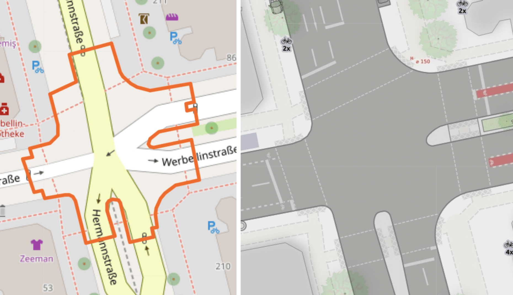

_Left: [OSM with `area:highway`-schape](https://www.openstreetmap.org/way/964402755); Right: The rendering vor comparison._

For crossings without `area:highway`, the stop line is rendered at 90° to the way at the position of the traffic signals (or stop sign) position. The length of the line depends on the number and width of lanes.

## Junctions: Experiments to draw lanes and turn lanes despite all…

I wrote before that junctions are basically blank areas, since rendering lanes and turn lanes right is just too hard. Of course, Alex tried anyway :-). Here are a few experiments.

_As the name suggests, those experiments are not standardized mapping practice and they do sometimes use non-standard tagging. This writeup is not meant as a review of those tags or to conclude the experiments. Instead it is meant to show what is possible and how, to continue and improve the discussion if and how to solve those mapping challenges._

### Experiment: Overwrite the cut-out-rule for all `cycleway crossing`

In cases where the cycleway is mapped as a separate way, rendering the cycleway in junctions works well – at least for simple cycleway crossing configurations.

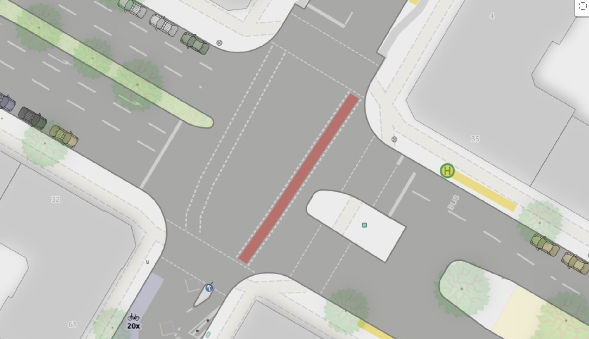

_https://supaplexosm.github.io/strassenraumkarte-neukoelln/?map=micromap#20/52.48606/13.43038, https://www.openstreetmap.org/way/975250080, Tip: Also change to the aerial image for this._

However, in cases where the cycleway is mapped as part of the main way, the rendering needs quite a bit more work to handle edge cases ([Example](https://supaplexosm.github.io/strassenraumkarte-neukoelln/?map=luftbild2020#21/52.46973/13.44170)).

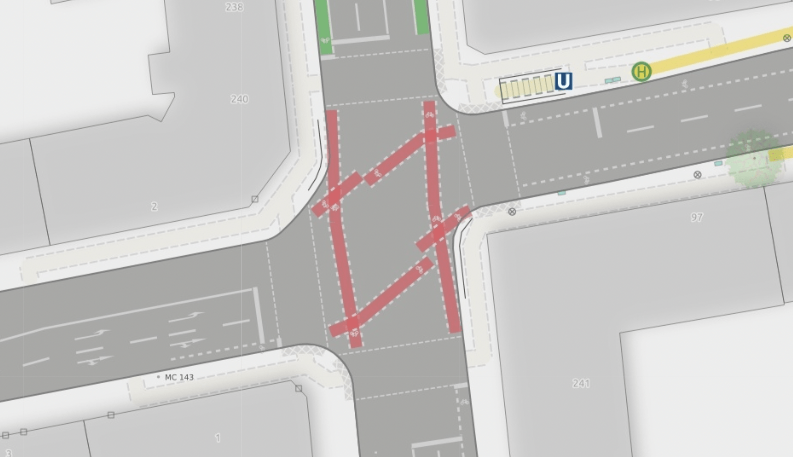

_https://supaplexosm.github.io/strassenraumkarte-neukoelln/?map=micromap#20/52.46770/13.44210, https://www.openstreetmap.org/way/1002249741_

### Experiment: Overwrite the cut out-rule by specifying `lane_markings:junction=yes` on the way.

It tells the renderer to add the lane markings even though this is an `area:highway`-junction.

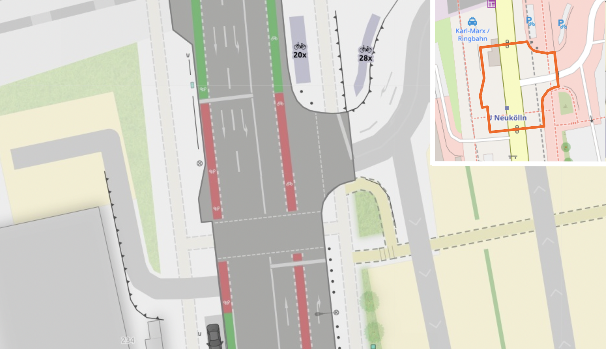

_https://supaplexosm.github.io/strassenraumkarte-neukoelln/?map=micromap#20/52.46864/13.44194, https://www.openstreetmap.org/way/989870961_

### Other approaches

There is an experimental taggging from 2014 to draw road markings https://wiki.openstreetmap.org/wiki/Key:road_marking which might be a way to solve the visual issues discussed here.

## Restricted areas

Since we just talked about `area:highway`, let’s have a look at another detail: The map also uses `area:highway=prohibited` to render restricted areas on the street ([traffic sign 298, Wikipedia](https://de.wikipedia.org/wiki/Datei:Zeichen_298_-_Sperrfl%C3%A4chen,_StVO_1970.svg)). We brushed of this [in our last update](https://supaplexosm.github.io/strassenraumkarte-neukoelln/posts/2021-07-18-strassenraumkarte#update), so here is an example:

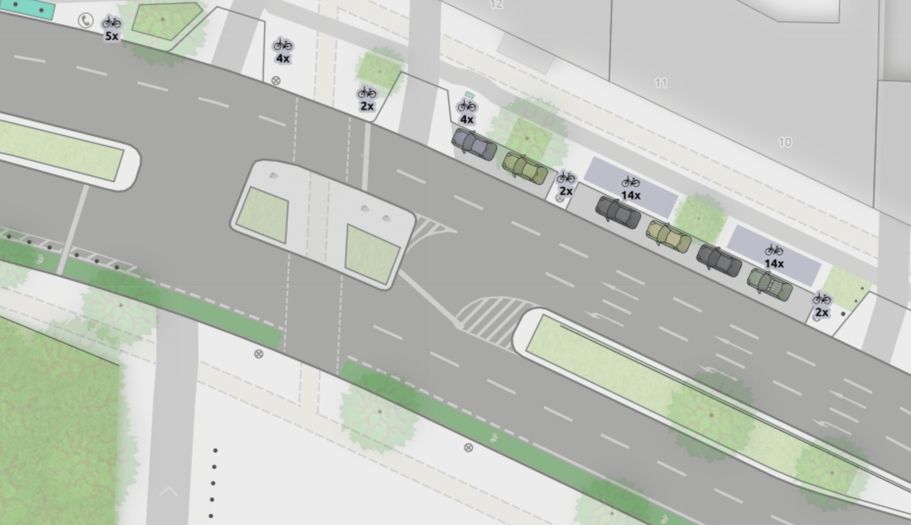

_https://supaplexosm.github.io/strassenraumkarte-neukoelln/?map=micromap#20/52.48725/13.42162, https://www.openstreetmap.org/way/964402773_

You [will also find places (Example)](https://supaplexosm.github.io/strassenraumkarte-neukoelln/?map=micromap#19/52.47129/13.44195) where this micro mapping is in conflict with the detailed rendering of bike lanes. [At Glasower Straße](https://supaplexosm.github.io/strassenraumkarte-neukoelln/?map=micromap#20/52.46476/13.43972), those markings are supposed to tame parked cars into their right spot, which makes for an unusuals pattern.

## Pedestrian crossings: Show them in detail…

Following the spirit of the map, pedestrian crossings are rendered as detailed as possible.

**Example: Zebra crossing** (and curb-extension)

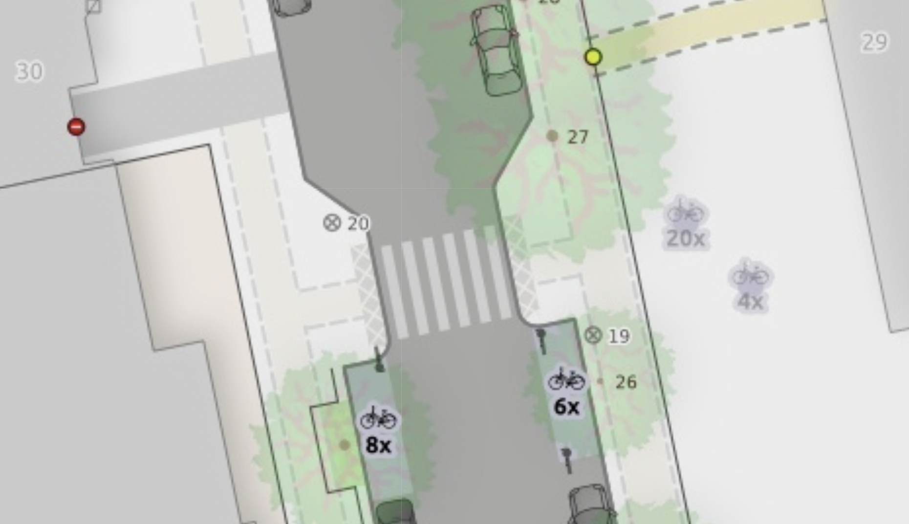

_https://supaplexosm.github.io/strassenraumkarte-neukoelln/?map=micromap#21/52.47588/13.43361, https://www.openstreetmap.org/node/4420684679 and https://www.openstreetmap.org/way/793810102_

**Example: Crossing with paint** `crossing:buffer_marking=both` (Experimental tagging, see [Wiki "Gehwege" (German)](https://wiki.openstreetmap.org/wiki/Berlin/Verkehrswende/Gehwege))

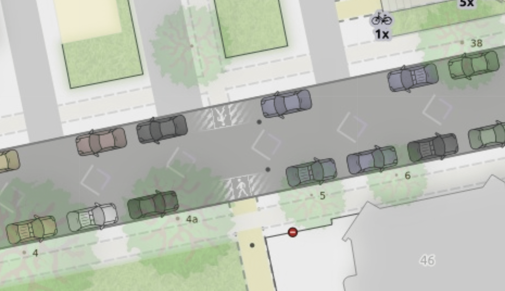

_https://supaplexosm.github.io/strassenraumkarte-neukoelln/?map=micromap#21/52.47587/13.42966, https://www.openstreetmap.org/node/681625830 and https://www.openstreetmap.org/way/1015325150_

This kind of crossing is often combined with marked, restricted areas.

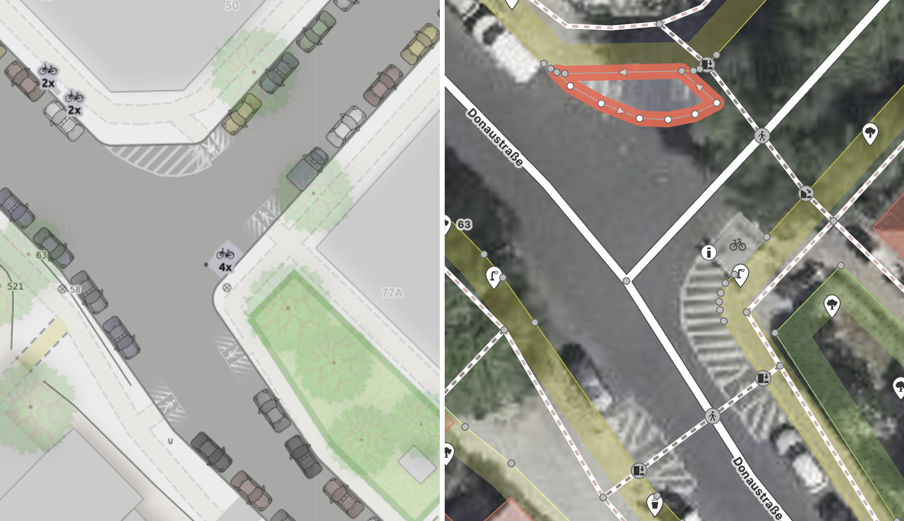

_https://supaplexosm.github.io/strassenraumkarte-neukoelln/?map=micromap#20/52.47788/13.44344, [OSM](https://www.openstreetmap.org/way/789750939), [Mapillary](https://www.mapillary.com/app/?z=17&lat=52.47775309999997&lng=13.443388599999935&dateFrom=2020-01-01&pKey=492187625399944&focus=photo&x=0.49307321872050786&y=0.5140713155264599&zoom=0)_

**Example: Traffic signal.**

Visually it’s just two lines, based on the crossing `width` or default (5 m). The pre-processor extends the line and then cuts them at the curb ([extreme example of this extension](https://supaplexosm.github.io/strassenraumkarte-neukoelln/?map=micromap#21/52.48162/13.43148)).

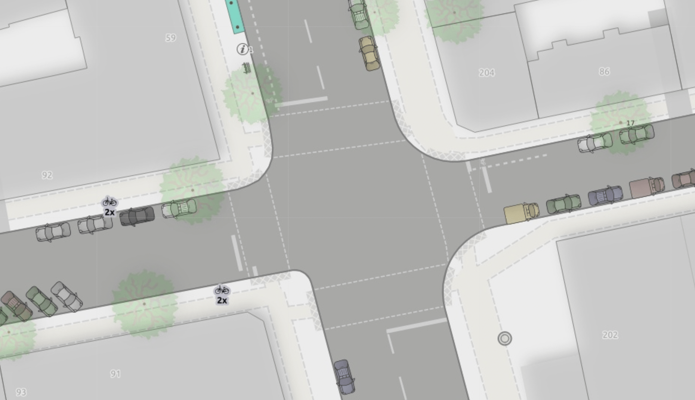

_https://supaplexosm.github.io/strassenraumkarte-neukoelln/?map=micromap#20/52.47613/13.42688, https://www.openstreetmap.org/node/5721694291 and https://www.openstreetmap.org/way/633262207_

Most crossings in this experimentation area of Neukölln are mapped as separate sidewalks. However, this rendering also works for crossings, that are mapped as just a node on the main way: [Example](https://supaplexosm.github.io/strassenraumkarte-neukoelln/?map=micromap#20/52.46385/13.42661), [OSM](https://www.openstreetmap.org/node/8119544899).

## Pedestrian crossing: Make tactile paving visible…

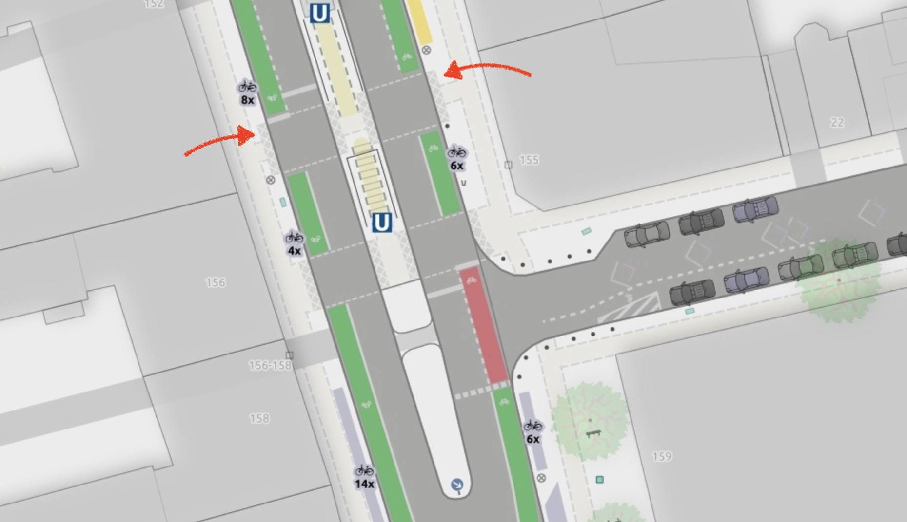

_https://supaplexosm.github.io/strassenraumkarte-neukoelln/?map=micromap#20/52.47587/13.43972_

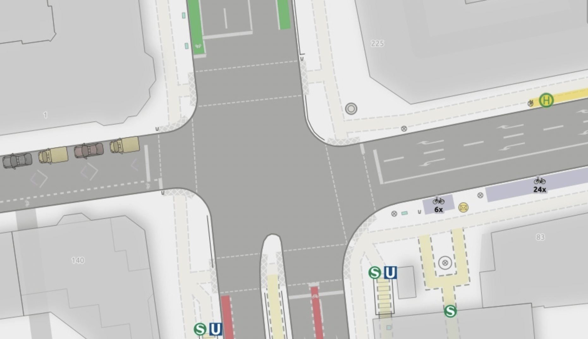

https://supaplexosm.github.io/strassenraumkarte-neukoelln/?map=micromap#20/52.46969/13.44181

The updated map provides some nice motivation to add [tactile paving tagging (Wiki)](https://wiki.openstreetmap.org/wiki/Key:tactile_paving) to the map. Add `kerb=* + tactile_paving=yes` as a node on the crossing way where it intersects with a `barrier=kerb` way that follows the curb.

To render it in the right place, the preprocessor creates a buffer circle around the curb node (with the buffer depending on the crossing `width` or using a default value) and clips the intersecting `barrier=kerb` way segments inside this buffer.

## Barrier boards

Another little detail of the map is how the more types of barriers become visible. We micromap them with `barrier=barrier_board + traffic_sign=DE:600` (if that is the case). In Neukölln, they are often used to split off sections of parked cars and protect bike stands.

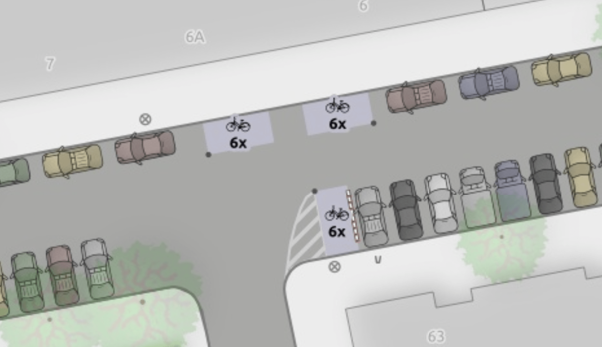

_https://supaplexosm.github.io/strassenraumkarte-neukoelln/?map=micromap#21/52.47212/13.43929_

## Individual trees in woods

Before we finish, let’s take a break and look at some trees.

They have always been rendered in a lot of detail – respecting the crown diameter where tagged ([`diameter_crown`](https://wiki.openstreetmap.org/wiki/Key:diameter_crown) and trying to derive a good fallback value based on height, age or the trunk’s [`circumference`](https://wiki.openstreetmap.org/wiki/Key:circumference).

Now, let’s have a look at the `natural=wood` in our [our Lessinghöhe park](https://supaplexosm.github.io/strassenraumkarte-neukoelln/?map=micromap#19/52.47673/13.43550) ([OSM](https://www.openstreetmap.org/way/211509952)).

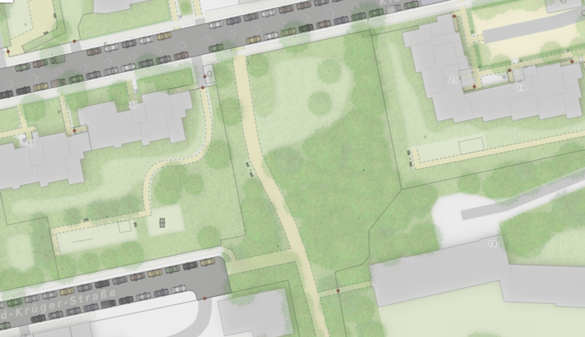

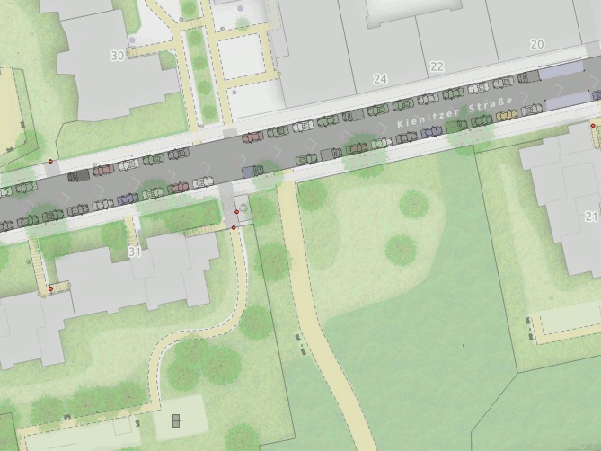

_https://supaplexosm.github.io/strassenraumkarte-neukoelln/?map=micromap#19/52.47667/13.43544, OSM https://www.openstreetmap.org/way/211509952_

The trees of the wood are placed randomly in a nicely organized hexagon grid, resulting in a random but tidy wood structure.

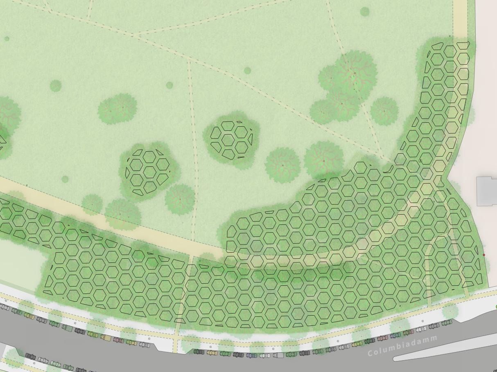

_https://supaplexosm.github.io/strassenraumkarte-neukoelln/?map=micromap#19/52.48046/13.41968, https://www.openstreetmap.org/way/1006745908_

But how do I know which tree is micro mapped (real) and which are "virtually" trees in woods? Glad you asked ;-). Separately mapped trees are indicated by the brown trunc in the middle (which size is based on the mapped or derived circumvence, of course).

## Finally, parked cars

In case you didn't know, this map first started as a side project to the parking analysis ([Map](https://supaplexosm.github.io/strassenraumkarte-neukoelln/?map=parkingmap#17/52.47379/13.43968), [Blogpost (EN)](https://www.openstreetmap.org/user/Supaplex030/diary/396104)). So those parked cars were already visualized in high detail right from the start.

But this would not be a good micro map update, without adding some details to parking, so here is a place where **only police may park**:

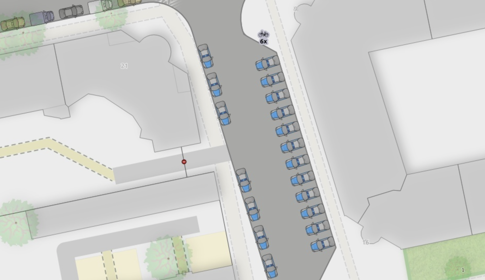

https://supaplexosm.github.io/strassenraumkarte-neukoelln/?map=micromap#20/52.47894/13.43466 / OSM https://www.openstreetmap.org/way/863913407 / Mapillary https://www.mapillary.com/app/?pKey=462701308177302&focus=photo&lat=52.47867120000001&lng=13.434658799971999&z=18.389500490558213&x=0.8305559661014242&y=0.43514557382174734&zoom=1.556720855042114

And a place where **only busses are allowed to park** `parking:condition:left|right:vehicles=bus`

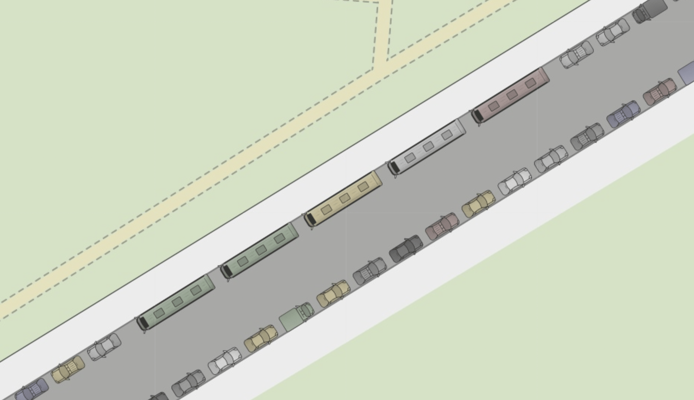

_https://supaplexosm.github.io/strassenraumkarte-neukoelln/?map=micromap#20/52.48558/13.40542, https://www.openstreetmap.org/way/949496688_

And a place where **only taxi are allowed to park** `parking:condition:right|left=taxi`

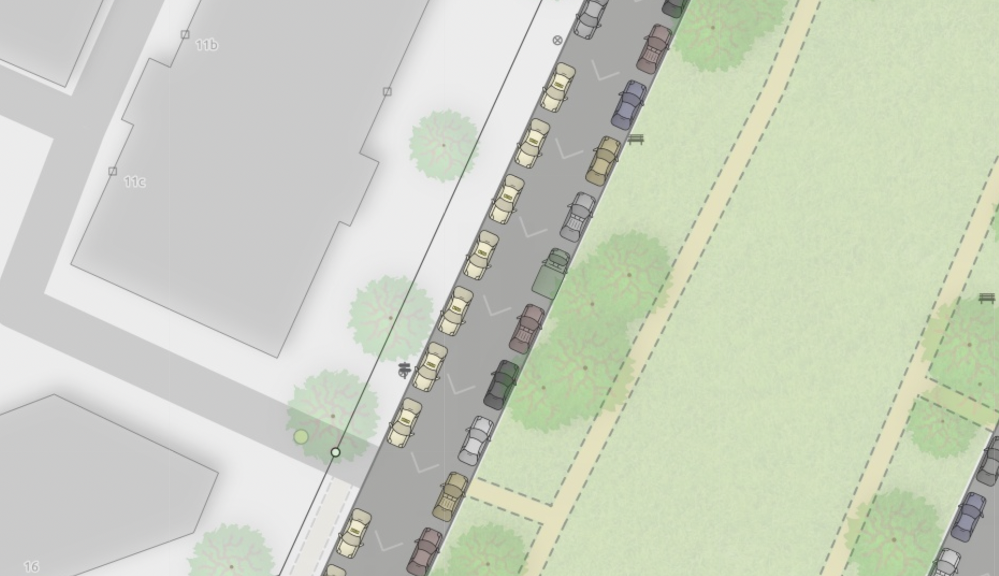

_https://supaplexosm.github.io/strassenraumkarte-neukoelln/?map=micromap#20/52.49254/13.41311, https://www.openstreetmap.org/way/933605619_

And a place where **only trucks and vans are allowed to park** `parking:condition:both:vehicles=hgv`

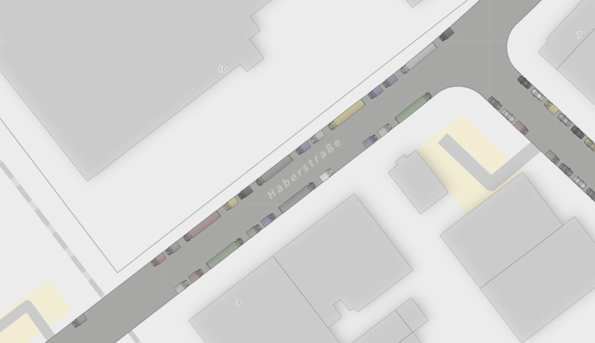

_https://supaplexosm.github.io/strassenraumkarte-neukoelln/?map=micromap#19/52.46333/13.46310, https://www.openstreetmap.org/way/723007528_

And of course there is a place where [parking is allowed only for motorcars](https://supaplexosm.github.io/strassenraumkarte-neukoelln/?map=micromap#20/52.45859/13.44175) `parking:condition:right:vehicles=motorcar` ([OSM](https://www.openstreetmap.org/way/5096142)), but that looks visually very similar (it's just the random vans that are missing).

## Let’s talk about preprocessed OSM data

In her SOTM 2021 talk, Sarah Hoffmann nudged us to [think about preprocessed OSM data (minute 21:54)](https://media.ccc.de/v/sotm2021-10046-boundaries-places-and-the-future-of-tagging#t=1314). This project is an example of that. It requires a lot of normalization and preprocessing to prepare the OSM data to be rendered.

And I am not talking about the trees, even though deriving the trunk size based on the crown diameter is certainly a fun processing experiment ;-).

There are two datasets here that would benefit from a standardized processing script and download: Parking data and lane data.

**Preprocessed parking data:**

For this experiment in Neukölln, [the data is available in a preprocessed format](https://github.com/SupaplexOSM/strassenraumkarte-neukoelln/tree/main/data) on GitHub. So is the [GQIS/Python Script to process the OSM parking data](https://github.com/SupaplexOSM/strassenraumkarte-neukoelln/blob/main/scripts/parking_lanes). And there is even [a video of Alex explaining with nice visual slides how the model works](https://pretalx.com/fossgis2021/talk/ZA7MQV/) in his FOSSGIS presentation from the beginning of the year.

Btw, we would like to continue evaluating this process. Read more at ["Call for help from the data science community: Evaluate tradeoffs in data quality for mapping parking data in OSM"](https://supaplexosm.github.io/strassenraumkarte-neukoelln/posts/2021-12-13-evaluate-tradeoffs-in-data-quality-vs-mapping-details).

**Preprocessed lane data:**

Alex published the [QGIS/Python Script](https://github.com/SupaplexOSM/strassenraumkarte-neukoelln/tree/main/scripts/post_processing) that does a lot of the processing described in this blogpost.

Interpreting OSM lane data for visualizations like this or projects like AB Street is extremely complex. Please check out and help the new osm2lanes projects that started work on a standardized parser for the lane schema at https://github.com/a-b-street/osm2lanes.

## Have fun exploring Neukölln

That’s it for this update. Have fun exploring Neukölln 👋.
